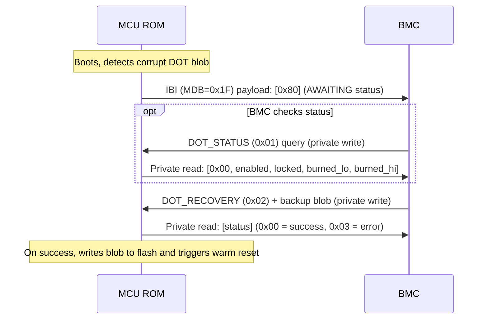
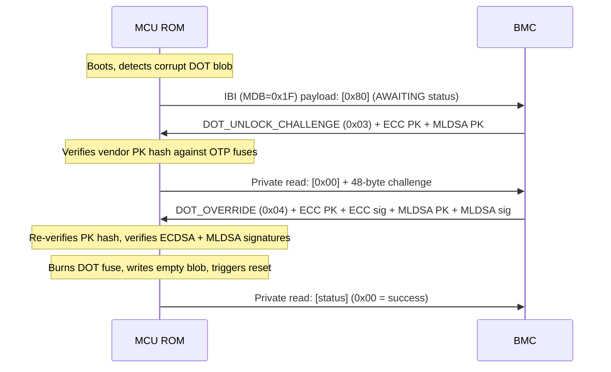

# DOT I3C Recovery Protocol

This document specifies the I3C-based transport protocol used for Device Ownership Transfer (DOT) recovery and override in the MCU ROM. For the overall DOT specification, see [Device Ownership Transfer](dot.md). For the general I3C services framework and framing, see [ROM I3C Services](rom_i3c_services.md).

## Overview

When the MCU ROM detects a corrupted or missing DOT blob while in ODD state (Locked or Disabled), the device enters DOT recovery mode via the ROM's I3C services handler (with `I3cServicesModes::DOT_RECOVERY` enabled). In this mode, the ROM waits for an external recovery agent to supply a backup DOT blob or perform a DOT override via challenge/response authentication over I3C.

### Recovery Trigger Conditions

DOT I3C recovery is entered when **any** of the following conditions are met:

1. **Empty/erased DOT blob with DOT enabled**: The DOT blob in flash is all zeros or all 0xFF, but the `DOT_INITIALIZED` fuse is set, indicating the device expects a valid DOT blob.
2. **Corrupt DOT blob in locked state**: The DOT blob exists in flash but fails HMAC authentication using the DOT_EFFECTIVE_KEY, and the DOT_FUSE_ARRAY is in ODD state (locked).
3. **Both A/B copies invalid**: If the device stores redundant DOT blob copies (A/B partitions) and both copies are missing or fail authentication, recovery is triggered.

### Recovery Options

The BMC has two recovery paths available over I3C:

- **DOT_RECOVERY** — Supply a backup DOT blob (HMAC'd with the current DOT effective key). This restores the blob without changing fuse state.
- **DOT_OVERRIDE** — Challenge/response authentication with the VendorKey. This burns a fuse (ODD→EVEN transition) and writes a new empty DOT blob, effectively factory-resetting device ownership.

### `DOT_RECOVERY` Flow

### `DOT_OVERRIDE` Flow

## Commands

All commands follow the [ROM I3C Services framing](rom_i3c_services.md), including the packetized transport for commands exceeding the 256-byte TTI FIFO (DOT_UNLOCK_CHALLENGE at ~2.7 KB and DOT_OVERRIDE at ~7.4 KB require multiple packets). The command byte is the first byte of every packet header. Responses are read via private read transactions.

| Cmd ID | Name | Payload | Description |
|--------|------|---------|-------------|
| 0x01 | DOT_STATUS | (none) | Query current DOT fuse state |
| 0x02 | DOT_RECOVERY | backup DOT blob | Supply a backup DOT blob for recovery |
| 0x03 | DOT_UNLOCK_CHALLENGE | ECC PK + MLDSA PK | Start override: send vendor public keys |
| 0x04 | DOT_OVERRIDE | ECC PK + ECC sig + MLDSA PK + MLDSA sig | Complete override: send signed challenge response |

### DOT_STATUS (0x01)

Query the current DOT fuse state. No payload required.

**Request (private write):** `[0x01]`

**Response (private read):** `[status, enabled, locked, burned_lo, burned_hi]`

| Field | Size | Description |
|-------|------|-------------|
| status | 1 byte | `0x00` (SUCCESS) |
| enabled | 1 byte | `1` if DOT is initialized, `0` otherwise |
| locked | 1 byte | `1` if device is in ODD (locked) state |
| burned_lo | 1 byte | Low byte of DOT_FUSE_ARRAY burned count |
| burned_hi | 1 byte | High byte of DOT_FUSE_ARRAY burned count |

### DOT_RECOVERY (0x02)

Supply a backup DOT blob. The blob must be HMAC'd with the current DOT effective key (matching the device's fuse state).

**Request (private write):** `[0x02] [blob bytes...]`

The payload is the raw DOT blob (same format as stored in flash). Since the blob
exceeds 256 bytes, it is sent using the
[packetized transport](rom_i3c_services.md#packetized-transport).

**Response (private read):** `[status]`

- `0x00` — SUCCESS: blob authenticated and written to flash; device will reset.
- `0x02` — INVALID_PAYLOAD: payload too small.
- `0x03` — ERROR: blob authentication failed or flash write error.

### DOT_UNLOCK_CHALLENGE (0x03)

Initiate a DOT override by sending the vendor's public keys (ECC P-384 + MLDSA-87). The ROM verifies the public key hash against the `VENDOR_RECOVERY_PK_HASH` stored in OTP fuses, then generates a random 48-byte challenge.

**Request (private write):**

The payload below is sent using the [packetized transport](rom_i3c_services.md#packetized-transport) (11 packets at 248 bytes each). Offsets are relative to the reassembled payload (after the packet header is stripped).

| Offset | Size | Field |
|--------|------|-------|
| 0 | 48 | ECC P-384 public key X coordinate (LE) |
| 48 | 48 | ECC P-384 public key Y coordinate (LE) |
| 96 | 2592 | MLDSA-87 public key |

**Response (private read):** `[status] [challenge...]`

- On success: `[0x00]` + 48-byte random challenge.
- On error: `[0x03]` (device not locked, no PK hash, PK hash mismatch, or RNG failure).

### DOT_OVERRIDE (0x04)

Complete the override by sending the vendor's public keys and signatures over the challenge. Must be preceded by a successful DOT_UNLOCK_CHALLENGE.

**Request (private write):**

The payload below is sent using the [packetized transport](rom_i3c_services.md#packetized-transport) (~30 packets at 248 bytes each). Offsets are relative to the reassembled payload.

| Offset | Size | Field |
|--------|------|-------|
| 0 | 48 | ECC P-384 public key X coordinate (LE) |
| 48 | 48 | ECC P-384 public key Y coordinate (LE) |
| 96 | 48 | ECDSA P-384 signature R (LE) |
| 144 | 48 | ECDSA P-384 signature S (LE) |
| 192 | 2592 | MLDSA-87 public key |
| 2784 | 4628 | MLDSA-87 signature |

**Response (private read):** `[status]`

- `0x00` — SUCCESS: signatures verified, fuse burned, empty DOT blob written; device will reset.
- `0x02` — INVALID_PAYLOAD: payload too small.
- `0x03` — ERROR: no prior challenge, PK hash mismatch, signature verification failed, fuse burn error, or flash write error.

## Security Considerations

- The ECDSA signature is verified over `SHA-384(challenge)`, while the MLDSA signature is verified over the raw 48-byte challenge.
- The PK hash is re-verified in the DOT_OVERRIDE message (not just DOT_UNLOCK_CHALLENGE) to prevent an attacker from substituting different keys between the two messages.
- All commands are gated by `I3cServicesModes::DOT_RECOVERY` — they are not available unless the platform explicitly enables them.

## DOT Recovery Reset Coordination

The I3C command protocol above is an interactive in-ROM DOT repair path. A platform may instead use a higher-level DOT recovery reset flow to make the failure visible to BMC before MCU ROM writes a fatal error register that may cause a SoC warm reset. This reset-coordination flow does not repair the DOT blob directly.

These are policy alternatives for a DOT failure. If the platform enables the DOT recovery reset flow, MCU ROM may report the failure and fatal out instead of entering the interactive `DOT_RECOVERY` / `DOT_OVERRIDE` command loop for that boot.

`I3CCSR.I3C_EC.SecFwRecoveryIf.DEVICE_STATUS_0` is encoded as:

| Bits | Field | Meaning |
|------|-------|---------|
| `[7:0]` | `DevStatus` | Device status. `0x0E` means Boot Failure (Recover Reason Code populated). |
| `[15:8]` | `ProtError` | Protocol error. `0x00` means no protocol error. |
| `[31:16]` | `RecReasonCode` | Recovery reason code. `0x80`-`0xFF` are vendor-unique boot failure codes. |

The DOT recovery reset flow uses the following `DEVICE_STATUS_0` value:

| Value | `DevStatus` | `ProtError` | `RecReasonCode` | Meaning |
|-------|-------------|-------------|-----------------|---------|
| `0x94000E` | `0x0E` Boot Failure (Recover Reason Code populated) | `0x00` no protocol error | `0x0094` vendor-unique code | MCU ROM DOT blob empty/corrupt or HMAC validation failure. |

### Boot Flow Context

1. If debug intent is asserted, Caliptra Core does not install any owner PK hash and Caliptra Core ROM skips owner key authentication during firmware validation.
2. If the device lifecycle is not `PROD` or `PROD_END`, MCU ROM skips the DOT flow.
3. MCU ROM reads the DOT blob from flash, if DOT flash is configured.
4. MCU ROM validates the DOT blob HMAC through Caliptra Core HMAC services.
5. If the DOT blob is empty/corrupt or DOT blob HMAC validation fails, MCU ROM enters the Caliptra SS error handling flow. A low-level DOT flash read error is a direct fatal error.
6. If DOT blob HMAC validation succeeds, MCU ROM obtains the owner PK hash from the DOT blob.
7. MCU ROM sends the owner PK hash to Caliptra Core with `INSTALL_OWNER_PK_HASH`.
8. MCU ROM sends `RI_DOWNLOAD_FIRMWARE` to Caliptra Core.
9. If non-streaming/SPI boot is used, Caliptra Core loads the firmware bundle through the AXI recovery/streaming boot path.
10. If I3C streaming boot is used, Caliptra Core loads the firmware bundle through the I3C streaming boot path.
11. If firmware authentication succeeds, MCU ROM continues the boot flow and eventually jumps to MCU runtime.

### MCU ROM DOT Blob Corrupt or HMAC Failure

1. MCU ROM detects an empty/corrupt DOT blob or DOT blob HMAC validation failure.
2. MCU ROM sets I3C OCP recovery `I3CCSR.I3C_EC.SecFwRecoveryIf.DEVICE_STATUS_0 = 0x94000E`.
3. MCU ROM writes `mci_top.mci_reg.FW_ERROR_FATAL`, which may result in SoC warm reset. Recommendation: SoCs should not automatically trigger a warm reset from this condition before BMC can observe `DEVICE_STATUS_0 = 0x94000E`, since that can create a reset loop.
4. BMC cold resets the SoC or platform.

### System Error Recovery Flow

1. BMC waits for the device to indicate clean boot through `I3CCSR.I3C_EC.SecFwRecoveryIf.DEVICE_STATUS_0`.
2. If there is an error, BMC reads the failing scenario or error code from device status, fatal error registers, boot status, or platform-specific sideband state. Example failures include:
    - SPI firmware flash boot failed / switch to streaming boot.
    - Low-level DOT flash read failure, which is a direct fatal error.
    - Empty/corrupt DOT blob or DOT HMAC failure.
    - DOT owner authentication failure.
3. BMC configures the device-specific boot mode if needed, such as streaming boot or SPI boot. This may be done through GPIO or another platform-specific mechanism.
4. BMC cold boots the SoC or the full platform.
5. On the next cold boot, BMC waits until the I3C recovery interface is reachable, then sets `I3CCSR.I3C_EC.SecFwRecoveryIf.DEVICE_RESET.RESET_CTRL` to one of the DOT recovery encodings:
    - `0x10`: previous DOT flow failed.
    - `0x11`: continue with regular boot.
6. Caliptra MCU ROM waits for `I3CCSR.I3C_EC.SecFwRecoveryIf.DEVICE_RESET.RESET_CTRL` to be either `0x10` or `0x11` early in cold boot.
7. Caliptra MCU ROM goes through the boot flow:
    - If `I3CCSR.I3C_EC.SecFwRecoveryIf.DEVICE_RESET.RESET_CTRL = 0x10`, MCU ROM loads the fused owner PK hash into Caliptra Core with `INSTALL_OWNER_PK_HASH`.
    - If `I3CCSR.I3C_EC.SecFwRecoveryIf.DEVICE_RESET.RESET_CTRL = 0x11`, MCU ROM continues with regular DOT HMAC blob verification and the remaining boot flow.
