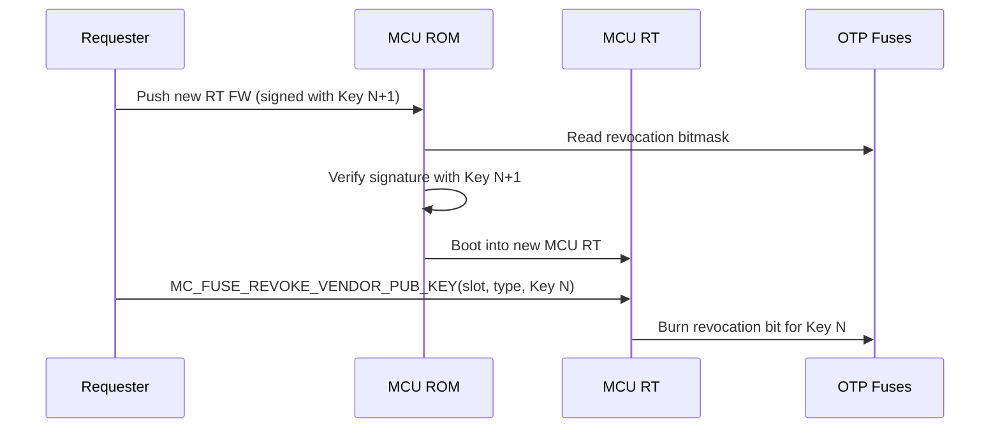
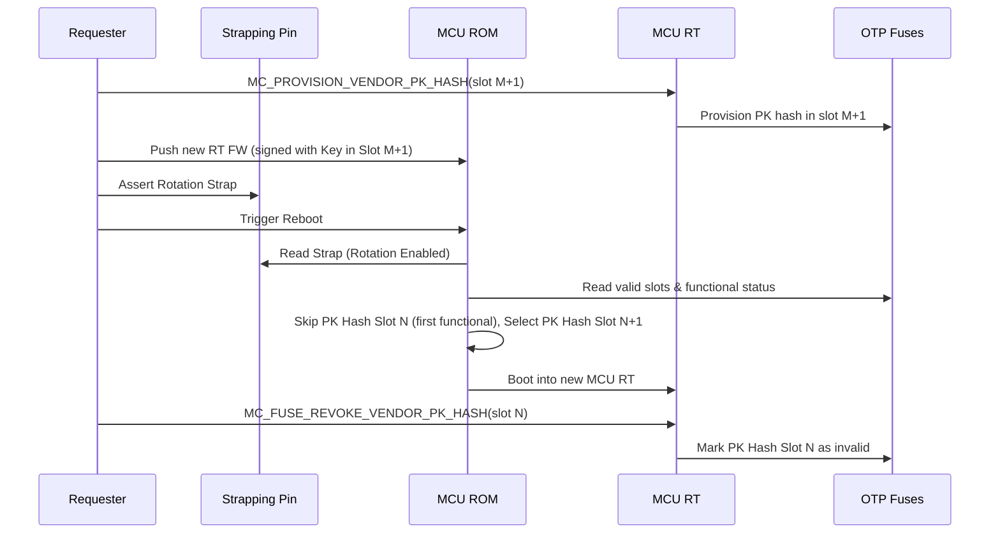

# Integrator's Guide

This guide provides recommendations for platform integrators building on
Caliptra MCU.

Identifier convention: this guide uses `lower_snake_case` for integrator-defined
OTP field names from `hw/fuses.hjson`, and `UPPER_SNAKE_CASE` for generated
Rust constants, command IDs, Caliptra registers, and partition names.

## DOT Integration Recommendations

For the full DOT protocol, state machine, and I3C recovery command details, see
[Device Ownership Transfer](./dot.md) and
[DOT I3C Recovery Protocol](./dot_i3c.md). This section calls out the platform
choices that must be made by an integrator.

### DOT mode and storage planning

DOT can be deployed in two broad modes:

| Mode | Persistent ownership | Fuse use | Required platform storage |
|---|---|---|---|
| Volatile DOT | No. Ownership is lost on power cycle. | None beyond optional DOT enablement. | Ownership storage that is retained across the reset level needed by the DOT flow. |
| Mutable locking DOT | Yes. Ownership is sealed to the device across power cycles. | `dot_fuse_array` bits consumed by lock/unlock/disable/override and rotation transitions. | DOT blob flash storage plus ownership storage handoff between ROM and runtime. |

If mutable locking DOT is enabled, the platform must provide non-volatile DOT
blob storage through `RomParameters::dot_flash`. The DOT blob is not secret, but
it must be available and authenticated on every ODD-state boot. If the blob is
missing, erased, corrupt, or HMAC-invalid while the part is in ODD state, ROM
enters the configured locked-state recovery path or reports a fatal DOT error.

Integrators should treat the DOT blob flash layout as a platform-owned recovery
asset. Keep enough space for the active blob and any backup blob policy your
platform needs, and make sure recovery agents know which copy is authoritative
for the current fuse count.

### DOT fuse array sizing

The `dot_fuse_array` field in the vendor non-secret OTP partition tracks Device
Ownership Transfer (DOT) state transitions. Lock, unlock, disable, and override
each burn one bit; key rotation burns two bits to preserve lock/unlock parity.
The array uses the current MCU `OneHot` layout name for a monotonic bit-count
counter. The layout name does not mean true one-hot encoding. The total number of bits
determines the maximum number of ownership state transitions over the lifetime
of the part. It must reside in a non-ECC protected partition (such as the
`VENDOR_TEST_PARTITION` in the reference map) because ECC calculation across a
partition forbids writing to it more than once, whereas monotonic bit-count
counters must be incremented sequentially over time.

A full ownership transfer cycle (install → lock → unlock) consumes **2 fuse
bits**: one for the lock transition (EVEN → ODD) and one for the unlock
transition (ODD → EVEN). Therefore:

| Logical fuse bits | Lock/unlock cycles | Notes |
|:---------:|:------------------:|-------|
| 64        | 32                 | Recommended minimum. |
| 256       | 128                | Default in the reference `hw/fuses.hjson`. |

The right size depends on how many ownership transfers the part is expected to
undergo in its lifetime. There is no way to reclaim burned fuse bits — once the
array is exhausted, no further mutable DOT transition can be committed. Any
operation that requires burning the next DOT bit will fail, so reserve margin for
service events such as unlock, override, and key-rotation flows rather than
sizing only for the happy-path number of ownership transfers.

The reference implementation burns the next sequential bit and reports a fatal
DOT error if no bit remains. Platforms that need stronger wear budgeting or
product-specific lifetime policy should size the field accordingly or provide a
custom DOT state policy in their platform integration.

### DOT blob and transition power-loss policy

The DOT fuse and DOT blob must advance together. A state transition that burns a
fuse without leaving a matching HMAC-sealed blob can strand the device in a
state that requires recovery on the next boot.

The ROM-owned firmware manifest DOT section provides an owner-signed,
idempotent way to request DOT state changes during boot. It is the preferred
path for field-driven DOT lock, unlock, rotate, and disable operations when the
platform wants immutable ROM code to perform the fuse burn. See
[Firmware Manifest DOT Section](./firmware_format.md#firmware-manifest-dot-section)
for the exact header format and power-loss windows.

For platforms that expose runtime DOT commands directly, the runtime must follow
the same ordering rules: write the DOT blob expected by the post-transition fuse
state, verify it can be recovered if power is lost, and only then ask ROM or the
trusted fuse-burning path to advance the fuse. Maintaining redundant active and
backup DOT blobs is strongly recommended for mutable locking deployments.

### Vendor recovery PK hash

The `vendor_recovery_pk_hash` fuse stores the SHA-384 hash of the vendor recovery
public key (VendorKey) used for `DOT_OVERRIDE` — a catastrophic recovery
command that force-unlocks the DOT state when no backup DOT blob is available
(e.g., RMA scenarios). This fuse is **optional**: if your deployment does not
require vendor-level catastrophic recovery, it can be left unprovisioned.

If provisioned, the hash is stored in the `VENDOR_NON_SECRET_PROD_PARTITION` and
occupies **48 bytes** (384 bits). It uses a `Single` layout because the value is
a write-once hash, not a monotonic counter. The on-OTP byte layout matches the
`CPTRA_SS_OWNER_PK_HASH` and debug-unlock vendor PK hash convention: each
4-byte word is stored byte-reversed relative to the natural SHA-384 byte order.

Provision this fuse only if the product intentionally supports vendor override.
Leaving it zero permanently disables `DOT_OVERRIDE` for that part; recovery must
then rely on a valid backup DOT blob or a platform-specific recovery mechanism.
If provisioned, protect the corresponding VendorKey private keys as catastrophic
recovery credentials.

### DOT locked-state recovery policy

When ROM detects an ODD-state DOT failure, the platform decides which recovery
policy is compiled into `RomParameters::dot_locked_recovery_handlers`:

| Recovery option | Required platform support | Result |
|---|---|---|
| Backup blob recovery | A recovery handler that can read a backup DOT blob sealed for the current fuse count. | Restores the DOT blob and resets without changing DOT fuse state. |
| I3C DOT recovery services | `I3cServicesModes::DOT_RECOVERY` plus an external recovery agent over I3C. | Allows `DOT_STATUS`, `DOT_RECOVERY`, and `DOT_OVERRIDE` commands over ROM I3C services. |

Integrators may configure more than one locked-state recovery handler; ROM tries
the configured handlers in order and stops at the first one that succeeds. The
I3C service path is a ROM recovery protocol and is separate from runtime
management paths. Runtime-originated recovery or field-management workflows
should be described by transport: in-band through a SoC-side MCI mailbox agent,
or out-of-band through SPDM VDM over MCTP/I3C. All DOT I3C service commands are
available only when the platform explicitly enables the corresponding ROM
service mode.

### Fuse storage cost summary

| Fuse field | Partition | Size | Encoding | Notes |
|---|---|:---:|---|---|
| `dot_initialized` | `VENDOR_NON_SECRET_PROD_PARTITION` | 1 bit (3 bytes with 3× OR duplication) | `LinearOr` | Gates the DOT flow. |
| `dot_fuse_array` | `VENDOR_TEST_PARTITION` | 256 bits (32 bytes) | `OneHot` (bit-count counter) | State counter. Must be in a non-ECC partition. Scales linearly with desired lock/unlock cycles. |
| `vendor_recovery_pk_hash` | `VENDOR_NON_SECRET_PROD_PARTITION` | 384 bits (48 bytes) | `Single` | Optional. For `DOT_OVERRIDE` catastrophic recovery. |

If OTP space is constrained, the `dot_fuse_array` can be made smaller — the
minimum useful size is 2 bits, but this only allows a single lock/unlock cycle
with no margin. If redundant bit-count encoding (`OneHotLinearOr`) is used,
multiply the raw bit count by the duplication factor (e.g., 3×).

### Non-ECC Partition Requirement for Incremental Counters

Monotonic bit-count counters such as `dot_fuse_array`, `mcu_component_svn_manifest_min_svn`, and SoC image SVN counters (`soc_image_min_svn_*`) are written incrementally over multiple boot cycles or state transitions. They **must not** be placed in ECC-protected partitions (like `VENDOR_NON_SECRET_PROD_PARTITION`), because ECC calculation over a partition prevents subsequent write operations once programmed.

In the reference map, these fields are placed in `VENDOR_TEST_PARTITION` (specifically `VENDOR_TEST`). If the test partition is needed for other testing or integration purposes in your deployment, a new vendor fuse partition that is **not ECC-protected** should be added to accommodate these incremental fuse values.

### SoC Image SVN Counters

In the reference schema and map, `soc_image_min_svn_0` and `soc_image_min_svn_1` are provided as baseline examples. More (or fewer) SoC image SVN values should be added or removed depending on the component architecture and anti-rollback requirements for the integration.

## Owner Public Key Hash Provisioning

- If you are using DOT for ownership management, provisioning
  `CPTRA_SS_OWNER_PK_HASH` is optional. See the
  [cold boot flow](./rom.md#cold-boot-flow) for details on how the ROM
  determines the owner PK hash.
- If you are **not** using DOT, then `CPTRA_SS_OWNER_PK_HASH` is the sole
  source of the owner PK hash and must be provisioned or another integrator-
  specific mechanism must be used.
- Reference platform ROMs also support a force-fuse-owner recovery policy:
    asserting `mci_reg_generic_input_wires[1]` bit 28 sets
    `OwnerPkHashPolicy::ForceFuse`, bypasses the DOT blob, and requires
    `CPTRA_SS_OWNER_PK_HASH` to be provisioned. If the forced fuse owner path is
    requested while the fuse is empty, ROM reports a fatal error.

## SVN Anti-Rollback Integration

For the full SVN format and flow details, see
[SVN Anti-Rollback](./svn.md). The integrator guide calls out the platform
decisions that must be made before enabling the feature.

### SVN ownership model

MCU Runtime does not define a separate runtime SVN. Its running SVN is the SoC
manifest SVN that Caliptra Core authenticates and binds into the MCU Runtime DPE
context. The fuse-backed floor for this value is
`CPTRA_CORE_SOC_MANIFEST_SVN`; Caliptra Core enforces it, but MCU ROM performs
the OTP burn because Caliptra Core cannot write its own fuses.

The optional MCU Component SVN Manifest is a 1024-byte authenticated header in
the MCU runtime image. When present and enabled by ROM configuration, it can
request floors for:

| Requested floor | Fuse advanced by MCU ROM | Purpose |
|---|---|---|
| `min_svn` | `MCU_COMPONENT_SVN_MANIFEST_MIN_SVN` | Anti-rollback for the manifest header itself. |
| `caliptra_runtime_min_svn` | `CPTRA_CORE_RUNTIME_SVN` | Caliptra Runtime floor. ROM checks this against `FW_INFO.fw_svn` before burning. |
| `soc_manifest_min_svn` | `CPTRA_CORE_SOC_MANIFEST_SVN` | SoC manifest / MCU Runtime floor. |
| Per-entry `min_svn` | `SOC_IMAGE_MIN_SVN[i]` | Optional per-component SoC image floor. |

ROM performs all anti-rollback and range checks described in the SVN
Anti-Rollback flow before burning any SVN fuse. If one of those validation
checks fails, ROM halts before any SVN floor is advanced. All SVN burns are
skipped when `CPTRA_CORE_ANTI_ROLLBACK_DISABLE` is set.

SVN manifest processing is opt-in. The ROM must be built with the
`svn-manifest` feature and `RomParameters::svn_manifest_enabled` must be set;
otherwise the header format may exist in the image, but ROM will not process it.

### SVN fuse planning

Integrators must allocate any MCU-owned SVN fuses in OTP storage that supports
monotonic in-field updates. These fuses are not static provisioning values:
MCU ROM may burn additional one-hot bits over the lifetime of the device. Do
not place them in a partition that is finalized by ECC, hardware digest, or
software digest in a way that prevents later `0 -> 1` burns or invalidates the
partition integrity check after an update.

In the reference fuse map these fields are described as vendor non-secret
fields, but production integrations must verify the physical partition policy.
If the generated `VENDOR_NON_SECRET_PROD_PARTITION` is digest protected or
locked after provisioning, either configure a vendor partition that is intended
for repeated monotonic updates, or add a separate vendor partition for MCU-owned
SVN fuses.

| Fuse | Recommended layout | Notes |
|---|---|---|
| `MCU_COMPONENT_SVN_MANIFEST_MIN_SVN` | `OneHotLinearOr` with 3x duplication | Required if the MCU Component SVN Manifest is enabled. |
| `SOC_IMAGE_MIN_SVN[i]` | `OneHotLinearOr` with 3x duplication | Optional per-component floors. Allocate as many slots as the platform needs. |

The reference fuse map allocates 10 logical SVN bits for each of these fields,
stored as 30 raw bits and rounded to a 4-byte field. Platforms may choose a
larger logical range, but the encoding must remain one-hot so increments only
burn additional OTP bits.

For per-component enforcement, the platform must compile an `SVN_FUSE_MAP` into
ROM (and keep the corresponding runtime configuration in sync). The map binds
Caliptra SoC manifest `component_id` values to `SOC_IMAGE_MIN_SVN[i]` fuse
slots. Multiple component IDs may share one slot if those components always move
together and use the same floor policy.

### Adding SVN fuse storage

The Caliptra SS fuse controller generator controls the physical OTP partition
map. See the Caliptra SS
[Generate `fuse_ctrl` Partitions](https://github.com/chipsalliance/caliptra-ss/blob/main/tools/scripts/fuse_ctrl_script/gen_fuse_ctrl_partitions.md)
documentation for the generator flow, including how
`gen_fuse_ctrl_partitions.yml` and the Mako templates produce
`otp_ctrl_mmap.hjson`, RTL, RDL, and documentation.

When adding storage for MCU-owned SVN fuses, integrators should:

1. Size or add a vendor non-secret in-field partition in the Caliptra SS fuse
    controller configuration. The generator documentation explains the mechanics
    for vendor-specific partition sizing; field names and MCU-specific layouts
    are defined in this repository's `hw/fuses.hjson`.
2. Ensure the selected partition's protection policy is compatible with
    repeated one-hot burns. SVN, DOT counters, and revocation bitmasks should not
    be finalized by ECC/digest protection before the last expected field update.
3. Map each MCU-visible field in `hw/fuses.hjson` to the generated OTP item and
    use a one-hot layout (`OneHot` or `OneHotLinearOr`) so increments require
    only additional `0 -> 1` burns.
4. Update `RomParameters::svn_fuse_map` for every SoC `component_id` that needs
    a per-component floor. Leave entries unmapped only when the component is
    intentionally not enforced by MCU-owned SVN fuses.
5. Validate update and power-loss behavior: ROM intentionally performs the SVN
    Anti-Rollback flow's anti-rollback and range checks before burning any SVN
    fuse, but the platform must still ensure OTP write, digest, and
    partition-lock policy are compatible with the planned field workflow.

### Field update workflow

The preferred field workflow for SoC manifest / MCU Runtime SVN increments is a
signed firmware update containing an authenticated MCU Component SVN Manifest
with the desired `soc_manifest_min_svn`. MCU ROM burns the requested floor in
the firmware-boot reset path, or in the hitless-update reset path, after
Caliptra Core has loaded the runtime image into MCU SRAM.

There is also an authorized runtime mailbox command,
`MC_FUSE_INCREASE_CALIPTRA_MIN_SVN`, that advances the Caliptra firmware minimum
SVN directly in the `CALIPTRA_FW_SVN` fuse. The reference runtime exposes this
command through the in-band MCI mailbox path today and requires the runtime
authorization flow. It rejects requests that are zero, above 128, lower than the
current fuse floor, or higher than the currently running Caliptra firmware SVN
reported by `FW_INFO`. Platforms that need BMC-originated workflows can route
the command through a trusted SoC-side agent today, or through an OOB SPDM VDM
path when that platform support is added.

## Management Command Transport Expectations

The runtime command set has two different management paths that should not be
treated as interchangeable:

| Path | Who can use it | Privileged commands in that path |
|---|---|---|
| MCI mailbox runtime interface | A SoC-side agent with MCI mailbox access, or an explicit platform proxy to that agent | Runtime handlers exist for `MC_PROVISION_VENDOR_PK_HASH`, `MC_FUSE_REVOKE_VENDOR_PUB_KEY`, `MC_FUSE_REVOKE_VENDOR_PK_HASH`, `MC_FUSE_INCREASE_CALIPTRA_MIN_SVN`, `MC_FE_PROG`, and generic fuse read/write/lock commands. |
| OOB SPDM VDM over MCTP/I3C | External BMC/OOB requester speaking the Caliptra SPDM VDM protocol | `Get Auth Challenge` and `Program Field Entropy` under the SPDM `Authorized Command` code today; platforms may add OOB wrappers for additional authorized commands as support lands. |

The `caliptra-util-host` mailbox transport is a software abstraction that
formats supported MCU mailbox commands through a platform-provided
`MailboxDriver`; it does not give an external BMC native access to the MCI
mailbox, and not every runtime MCI command is wrapped by the current host
utility dispatch tables. If an OOB BMC must initiate MCI-only operations such
as PK provisioning, PK revocation, or direct Caliptra SVN increment, the
platform must provide a trusted SoC-side service or bridge that owns the MCI
access, exposes the intended command wrappers, and enforces the deployment
policy.

## Vendor Public Key Selection and Rotation
Caliptra MCU supports a vendor public key selection and rotation scheme
based on fuses and hardware strapping pins. This section describes how the ROM
selects the active vendor public key slot and how integrators can manage
rotation and revocation.

### Key Policy and Selection Process
The ROM follows this process to select a vendor public key hash slot (out of 16
available slots):
1.  **Validity Check**: The ROM reads the `VENDOR_PK_HASH_VALID` fuse mask.
    Each bit corresponds to a slot. If a bit is set to `1`, the slot is
    considered invalid and skipped.
2.  **Revocation Check**: For each valid slot, the ROM checks the revocation
    status of the keys in the `CPTRA_CORE_ECC_REVOCATION_X`,
    `CPTRA_CORE_MLDSA_REVOCATION_X`, and `CPTRA_CORE_LMS_REVOCATION_X` fields:
    -   **ECC Keys**: Checked against the ECC revocation fuses (4 bits per
        slot).
    -   **PQC Keys**: Checked against PQC revocation fuses (4 bits for MLDSA,
        16 bits for LMS).
    A slot is considered **functional** if it has at least one unrevoked ECC key
    AND at least one unrevoked PQC key.
3.  **Default Selection**: By default, the ROM selects the **first functional
    slot** it encounters (searching from slot 0 to 15). However, this logic can
    be overridden by passing a different implementation of the `VendorKeyPolicy`
    into the ROM parameters.

### Key Rotation via Strapping

Integrators can force the ROM to rotate to the next available key by using a
hardware strapping pin:

- **Generic Input Wires**: `mci_reg_generic_input_wires[1]`
- **Bit 1 (Rotation)**: If this bit is set to `1`, the ROM will **skip the
  first functional slot** it finds and select the **second functional slot**.
  This allows a platform to switch to a new key without burning fuses, simply
  by changing a strapping register or GPIO state, provided that a second valid and
  functional key is provisioned in the fuses. This enables rolling back to the
  previous known-good firmware image should the new one have a fatal issue.

If the rotation strap is asserted but only one functional slot exists, the
default policy falls back to that one slot. Platforms that need arbitrary slot
selection or more complex rollout policy should provide a custom
`VendorKeyPolicy` in `RomParameters` instead of relying only on the reference
strap behavior.

### Vendor PK Hash Provisioning

New vendor PK hash slots can be provisioned in the field through
`MC_PROVISION_VENDOR_PK_HASH`. The command writes a 48-byte SHA-384 vendor PK
hash into the requested slot. It is idempotent if the slot already contains the
same hash, and fails if the slot is invalid or contains a different nonzero
hash. It is an authorized MCU Runtime mailbox command, so the requester must
complete the runtime authorization flow before invoking it.

This command is not exposed through the OOB SPDM VDM command set today. If the
BMC owns the operational workflow, it must call a trusted SoC-side agent or
platform proxy that has MCI mailbox access.

### Key Revocation

Keys can be revoked permanently by burning fuses. MCU Runtime exposes
authorized MCI mailbox commands for the supported in-field flows:

-   `MC_FUSE_REVOKE_VENDOR_PUB_KEY` revokes an individual firmware
    verification key within a vendor PK hash slot. The command supports ECC
    P-384, LMS, and MLDSA-87 key types and burns the corresponding bit in the
    slot's revocation field.
-   `MC_FUSE_REVOKE_VENDOR_PK_HASH` revokes an entire vendor PK hash slot by
    setting the corresponding bit in `VENDOR_PK_HASH_VALID` to `1`.

Both commands use the runtime authorization flow. They reject requests that
target the key or PK hash slot used to boot the currently running firmware. This
prevents a requester from bricking the current boot by revoking its own active
trust path; revocation is intended to happen after the device has successfully
booted with a replacement key or replacement PK hash slot.

Like provisioning, these revocation commands are not exposed through the OOB
SPDM VDM command set today. A BMC-originated field workflow therefore needs a
SoC-side MCI mailbox agent or an explicit platform proxy.

#### Command Authorization Mechanism

Command authorization across both MCU mailbox and SPDM VDM transports uses an
asymmetric challenge-response signature flow. To execute an authorized command
(e.g., key revocation or field entropy programming), the requester must:

1. Request a 32-byte challenge nonce from the device via `Get Auth Challenge`.
2. Compute dual asymmetric signatures (ECC P-384 and ML-DSA-87) over
   `cmd_id(BE) || payload(LE) || challenge(32)`.
3. Submit the command payload accompanied by the resulting hybrid signature.

Integrators configure the authorizer policy by implementing the platform
authorizer trait (`CommandAuthorizer` for mailbox or `CaliptraVdmCommands` for
SPDM VDM) and provisioning the corresponding verification public keys in OTP
fuses, secure platform storage, or embedded in firmware directly.

For per-key revocation, once all usable bits for a key type are burned in a
slot, that key type is fully revoked in that slot. The last key index for a
given key type cannot be revoked, matching Caliptra's requirement that a slot
retain at least one usable key of each required type.

### Key Revocation Flows

Caliptra MCU supports two revocation flows depending on whether the new key is
within the same PK hash slot or in a different slot.

#### Case 1: Revocation Within the Same PK Hash Slot

This flow is used when a specific sub-key within a PK hash slot needs to be
revoked (e.g., moving to a new key version) but other keys within that PK hash
remain trusted.

**Process**:
1.  Push a new Runtime (RT) firmware signed with a new key.
2.  After the device boots with the replacement key, an authorized requester
    sends `MC_FUSE_REVOKE_VENDOR_PUB_KEY` to MCU Runtime for the old key.
3.  MCU Runtime validates that the target key was not used for the current boot
    and burns the corresponding revocation bit.



#### Case 2: Revocation Across Different PK Hash Slots

This flow is used when the entire PK hash slot is compromised or needs to be
replaced, requiring a transition to a new PK hash slot.

**Process**:
1.  Provision the new vendor PK hash into an empty inactive slot if it was not
    provisioned during manufacturing.
2.  Push a new Runtime (RT) firmware signed with a key from the new PK hash slot.
3.  Additionally assert the hardware strapping pin (bit 1 of
    `mci_reg_generic_input_wires[1]`) to enable rotation.
4.  On reboot, the MCU ROM will select the new PK hash slot.
5.  An authorized requester sends `MC_FUSE_REVOKE_VENDOR_PK_HASH` to MCU
    Runtime to burn the old PK hash slot as invalid.



## ROM Milestone Hooks

The common ROM exposes a lightweight callback trait, `RomHooks`, that lets
integrators observe the boot flow at major milestones without forking the
common ROM code. Typical uses include:

- Structured logging / tracing (e.g. printing to a UART at each milestone)
- Latency measurements between phases
- Integration tests that need to assert the ROM reached a particular state

### Attaching hooks

Provide an implementation of `caliptra_mcu_rom_common::RomHooks` and pass a
reference to it via `RomParameters::hooks`:

```rust
use caliptra_mcu_rom_common::{RomHooks, RomParameters};

struct LoggingRomHooks;

impl RomHooks for LoggingRomHooks {
    fn pre_cold_boot(&self) {
        caliptra_mcu_romtime::println!("[rom-hook] pre_cold_boot");
    }
    fn post_cold_boot(&self) {
        caliptra_mcu_romtime::println!("[rom-hook] post_cold_boot");
    }
    // ...override as few or as many methods as you need; all have no-op defaults.
}

let hooks = LoggingRomHooks;
caliptra_mcu_rom_common::rom_start(RomParameters {
    hooks: Some(&hooks),
    ..Default::default()
});
```

All `RomHooks` methods have empty default implementations, so integrators
only override the hooks they care about. The field defaults to `None`, so
platforms that do not need hooks are unaffected.

Hook methods take `&self`. The common ROM is single-threaded, but
`RomParameters` is passed by value through the boot flows and we do not
want hooks to mutate it, so hook state that must change across calls should
use an interior-mutability primitive such as `core::cell::Cell` or
`core::cell::RefCell`.

### Available hooks

Pre/post pairs are invoked around each of the following milestones:

| Milestone | Pre hook | Post hook |
|---|---|---|
| Cold-boot flow | `pre_cold_boot` | `post_cold_boot` |
| Warm-boot flow | `pre_warm_boot` | `post_warm_boot` |
| Firmware-boot flow | `pre_fw_boot` | `post_fw_boot` |
| Firmware hitless update | `pre_fw_hitless_update` | `post_fw_hitless_update` |
| Caliptra core boot-go / `BOOT_DONE` | `pre_caliptra_boot` | `post_caliptra_boot` |
| Populating fuses to Caliptra | `pre_populate_fuses_to_caliptra` | `post_populate_fuses_to_caliptra` |
| Loading MCU firmware into SRAM | `pre_load_firmware` | `post_load_firmware` |

### Reachability caveats

The `post_*` hooks for the outer boot flows (`post_cold_boot`,
`post_warm_boot`, `post_fw_boot`, `post_fw_hitless_update`) are **best
effort**: the common ROM invokes them as the last action before the
terminating warm reset or jump to mutable firmware, but a fatal error
partway through a flow can prevent the post hook from being reached. Do
not rely on them for liveness guarantees — use them for optional telemetry
only.

Note also that on a single power-on the ROM typically exercises the
cold-boot flow followed by the firmware-boot flow; the warm-boot and
hitless-update hooks only fire on their corresponding reset paths.

### Example in the reference platforms

The emulator and FPGA reference platform ROMs include a `LoggingRomHooks`
example that prints `[mcu-rom-hook] <name>` at every hook. It is gated
behind the `test-rom-hooks` Cargo feature so normal production builds are
unaffected:

```sh
cargo xtask rom-build --platform emulator --features test-rom-hooks
```

The integration test `test_rom_hooks_fire_in_order` builds this ROM and
asserts that each expected hook marker appears exactly once in the
expected order.

## MCU SRAM Partitioning

The MCU's SRAM is divided into several regions by the firmware-bundler at
build time.  One of those regions — at the **top** of SRAM — is the
**persistent storage area**, reserved for attestation data that must
survive across hitless firmware updates and warm resets.

### Layout overview

For a platform with `sram_size` total SRAM, the firmware-bundler splits
the address space as follows:

```
┌─────────────────────────────────────────────────────────────┐
│  Instruction region (ITCM)                                  │
│  · Kernel .text                                             │
│  · Application .text                                        │
│                                                             │
├─────────────────────────────────────────────────────────────┤
│  Data region (DTCM)                                         │
│  · Kernel .bss / .data / stack                              │
│  · Application heap + grant space                           │
│                                                             │
├─────────────────────────────────────────────────────────────┤  ← _sstorage
│  Persistent storage  (storage_size)                         │
│  · DPE Handle Store  (first DPE_STORE_SIZE bytes)           │
│  · Software PCR Store (remainder)                           │
└─────────────────────────────────────────────────────────────┘  ← _estorage
```

The linker symbols `_sstorage` and `_estorage` mark the boundaries of
the persistent storage region and are generated automatically by the
firmware-bundler.  The kernel reads them at boot to initialise the DPE
Handle Store and Software PCR Store capsules.

The ITCM / DTCM split point is calculated by the firmware-bundler
(roughly half of total SRAM) and varies by build profile.

### Configuring `storage_size` for your platform

`storage_size` is set in the firmware-bundler manifest for your
platform.  For the reference emulator builds the manifests are:

| File | Profile | SRAM size |
|------|---------|-----------|
| `firmware-bundler/reference/emulator/user-app.toml` | release (shipping) | 512 KiB |
| `firmware-bundler/reference/emulator/user-app-devel.toml` | devel / debug | 1 MiB |
| `firmware-bundler/reference/fpga/user-app.toml` | FPGA | platform-specific |

Open the manifest for your target and adjust `storage_size`:

```toml
[platform]
# ...

# storage_size: reserve space at the top of SRAM for persistent
# attestation data (DPE Handle Store + Software PCR Store).
# Must be a multiple of 4 KiB;
```

> **Note**: `storage_size` is rounded up to a 4 KiB boundary by the
> firmware-bundler so that the value remains consistent with the VeeR
> `mcu_fw_sram_exec_region_size` parameter, which is programmed in
> 4 KiB units.

### PMP protection

The persistent storage region is mapped as a kernel-only read/write PMP
region, separate from the application RAM region.  Userspace processes
cannot access it directly; they interact with the stored data only
through the kernel capsule syscall interfaces
(`DpeHandleStore` driver `0x8000_0020` and `PcrStore` driver `0x8000_0021`).

