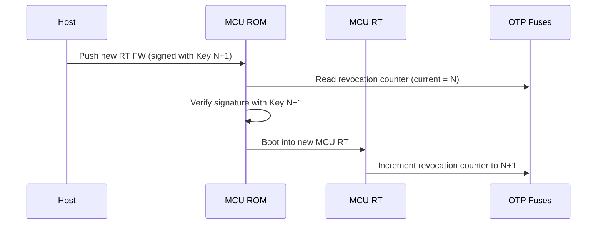
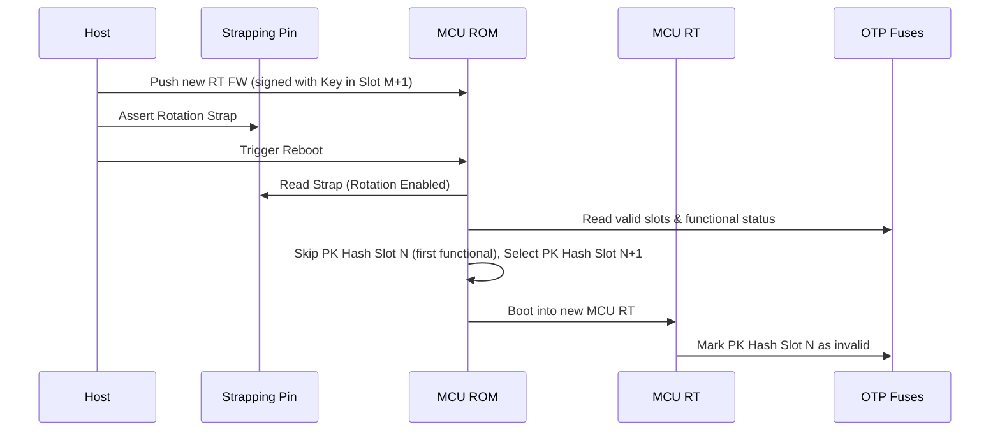

# Integrator's Guide

This guide provides recommendations for platform integrators building on
Caliptra MCU.

## DOT Fuse Recommendations

### DOT fuse array sizing

The `dot_fuse_array` field in the vendor non-secret OTP partition tracks Device
Ownership Transfer (DOT) state transitions. Each state change (lock, unlock,
disable) burns one bit, using a `OneHot` encoding. The total number of bits
determines the maximum number of ownership state transitions over the lifetime
of the part.

A full ownership transfer cycle (install → lock → unlock) consumes **2 fuse
bits**: one for the lock transition (EVEN → ODD) and one for the unlock
transition (ODD → EVEN). Therefore:

| Logical fuse bits | Lock/unlock cycles | Notes |
|:---------:|:------------------:|-------|
| 64        | 32                 | Recommended minimum. |
| 256       | 128                | Default in the reference `hw/fuses.hjson`. |

The right size depends on how many ownership transfers the part is expected to
undergo in its lifetime. There is no way to reclaim burned fuse bits — once the
array is exhausted, mutable locking DOT transitions are no longer possible and
the device can only operate in Volatile DOT mode (ownership lost on power
cycle).

### Vendor recovery PK hash

The `vendor_recovery_pk_hash` fuse stores the SHA-384 hash of the vendor recovery
public key (VendorKey) used for `DOT_OVERRIDE` — a catastrophic recovery
command that force-unlocks the DOT state when no backup DOT blob is available
(e.g., RMA scenarios). This fuse is **optional**: if your deployment does not
require vendor-level catastrophic recovery, it can be left unprovisioned.

If provisioned, the hash is stored in the `VENDOR_SECRET_PROD_PARTITION` and
occupies **48 bytes** (384 bits). Because it is write-once and ECC-protected,
no redundant encoding is needed.

### Fuse storage cost summary

| Fuse field | Partition | Size | Encoding | Notes |
|---|---|:---:|---|---|
| `dot_initialized` | `VENDOR_NON_SECRET_PROD_PARTITION` | 1 bit (3 bytes with 3× OR duplication) | `LinearOr` | Gates the DOT flow. |
| `dot_fuse_array` | `VENDOR_NON_SECRET_PROD_PARTITION` | 256 bits (32 bytes) | `OneHot` | State counter. Scales linearly with desired lock/unlock cycles. |
| `vendor_recovery_pk_hash` | `VENDOR_SECRET_PROD_PARTITION` | 384 bits (48 bytes) | `Single` | Optional. For `DOT_OVERRIDE` catastrophic recovery. |

If OTP space is constrained, the `dot_fuse_array` can be made smaller — the
minimum useful size is 2 bits, but this only allows a single lock/unlock cycle
with no margin. If redundant encoding (`OneHotLinearOr`) is used,
multiply the raw bit count by the duplication factor (e.g., 3×).

A different partition can also be used if there is one specifically allocated in
the integration-specific fuse map.

## Owner Public Key Hash Provisioning

- If you are using DOT for ownership management, provisioning
  `CPTRA_SS_OWNER_PK_HASH` is optional. See the
  [cold boot flow](./rom.md#cold-boot-flow) for details on how the ROM
  determines the owner PK hash.
- If you are **not** using DOT, then `CPTRA_SS_OWNER_PK_HASH` is the sole
  source of the owner PK hash and must be provisioned or another integrator-
  specific mechanism must be used.

## Vendor Public Key Selection and Rotation
Caliptra MCU supports a vendor public key selection and rotation scheme
based on fuses and hardware strapping pins. This section describes how the ROM
selects the active vendor public key slot and how integrators can manage
rotation and revocation.

### Key Policy and Selection Process
The ROM follows this process to select a vendor public key hash slot (out of 16
available slots):
1.  **Validity Check**: The ROM reads the `VENDOR_PK_HASH_VALID` fuse mask.
    Each bit corresponds to a slot. If a bit is set to `1`, the slot is
    considered invalid and skipped.
2.  **Revocation Check**: For each valid slot, the ROM checks the revocation
    status of the keys in the `CPTRA_CORE_ECC_REVOCATION_X`,  
    `CPTRA_CORE_MLDSA_REVOCATION_X`, and `CPTRA_CORE_LMS_REVOCATION_X` fields:
    -   **ECC Keys**: Checked against the ECC revocation fuses (4 bits per
        slot).
    -   **PQC Keys**: Checked against PQC revocation fuses (4 bits for MLDSA,
        16 bits for LMS).
    A slot is considered **functional** if it has at least one unrevoked ECC key
    AND at least one unrevoked PQC key.
3.  **Default Selection**: By default, the ROM selects the **first functional
    slot** it encounters (searching from slot 0 to 15). However, this logic can
    be overridden by passing a different implementation of the `VendorKeyPolicy`
    into the ROM parameters.

### Key Rotation via Strapping
Integrators can force the ROM to rotate to the next available key by using a
hardware strapping pin:
-   **Strap Register**: `SS_STRAP_GENERIC[3]`
-   **Bit 1 (Rotation)**: If this bit is set to `1`, the ROM will **skip the
    first functional slot** it finds and select the **second functional slot**.
This allows a platform to switch to a new key without burning fuses, simply
by changing a strapping register or GPIO state, provided that a second valid and
functional key is provisioned in the fuses. This enables rolling back to the
previous known-good firmware image should the new one have a fatal issue.

### Key Revocation
Keys can be revoked permanently by burning fuses:
-   Setting the corresponding bit in `VENDOR_PK_HASH_VALID` to `1` invalidates
    the entire slot.
-   Incrementing the revocation counters for ECC or PQC keys within a slot.
    Once all bits are burned (e.g., reaching `0xF` for MLDSA or ECC), that key
    type is fully revoked in that slot.

### Key Revocation Flows

Caliptra MCU supports two revocation flows depending on whether the new key is
within the same PK hash slot or in a different slot.

#### Case 1: Revocation Within the Same PK Hash Slot

This flow is used when a specific sub-key within a PK hash slot needs to be
revoked (e.g., moving to a new key version) but other keys within that PK hash
remiain trusted.

**Process**:
1.  Push a new Runtime (RT) firmware signed with a new key.
2.  The runtime, on startup, will identify that a key revocation is required and
    perform the appropriate fuse burn



#### Case 2: Revocation Across Different PK Hash Slots

This flow is used when the entire PK hash slot is compromised or needs to be
replaced, requiring a transition to a new PK hash slot.

**Process**:
1.  Push a new Runtime (RT) firmware signed with a key from a new PK hash slot.
2.  Additionally assert the hardware strapping pin (Bit 1 of
    `SS_STRAP_GENERIC[3]`) to enable rotation.
3.  On reboot, the MCU ROM will select the new PK hash slot.
4.  The MCU Runtime will then burn the old PK hash slot as invalid.



> Note: the development of the MCU Runtime mechanism to identify and perform the
revocation is being tracked in [this Github issue](https://github.com/chipsalliance/caliptra-sw/issues/2441).

## ROM Milestone Hooks

The common ROM exposes a lightweight callback trait, `RomHooks`, that lets
integrators observe the boot flow at major milestones without forking the
common ROM code. Typical uses include:

- Structured logging / tracing (e.g. printing to a UART at each milestone)
- Latency measurements between phases
- Integration tests that need to assert the ROM reached a particular state

### Attaching hooks

Provide an implementation of `caliptra_mcu_rom_common::RomHooks` and pass a
reference to it via `RomParameters::hooks`:

```rust
use caliptra_mcu_rom_common::{RomHooks, RomParameters};

struct LoggingRomHooks;

impl RomHooks for LoggingRomHooks {
    fn pre_cold_boot(&self) {
        caliptra_mcu_romtime::println!("[rom-hook] pre_cold_boot");
    }
    fn post_cold_boot(&self) {
        caliptra_mcu_romtime::println!("[rom-hook] post_cold_boot");
    }
    // ...override as few or as many methods as you need; all have no-op defaults.
}

let hooks = LoggingRomHooks;
caliptra_mcu_rom_common::rom_start(RomParameters {
    hooks: Some(&hooks),
    ..Default::default()
});
```

All `RomHooks` methods have empty default implementations, so integrators
only override the hooks they care about. The field defaults to `None`, so
platforms that do not need hooks are unaffected.

Hook methods take `&self`. The common ROM is single-threaded, but
`RomParameters` is passed by value through the boot flows and we do not
want hooks to mutate it, so hook state that must change across calls should
use an interior-mutability primitive such as `core::cell::Cell` or
`core::cell::RefCell`.

### Available hooks

Pre/post pairs are invoked around each of the following milestones:

| Milestone | Pre hook | Post hook |
|---|---|---|
| Cold-boot flow | `pre_cold_boot` | `post_cold_boot` |
| Warm-boot flow | `pre_warm_boot` | `post_warm_boot` |
| Firmware-boot flow | `pre_fw_boot` | `post_fw_boot` |
| Firmware hitless update | `pre_fw_hitless_update` | `post_fw_hitless_update` |
| Caliptra core boot-go / `BOOT_DONE` | `pre_caliptra_boot` | `post_caliptra_boot` |
| Populating fuses to Caliptra | `pre_populate_fuses_to_caliptra` | `post_populate_fuses_to_caliptra` |
| Loading MCU firmware into SRAM | `pre_load_firmware` | `post_load_firmware` |

### Reachability caveats

The `post_*` hooks for the outer boot flows (`post_cold_boot`,
`post_warm_boot`, `post_fw_boot`, `post_fw_hitless_update`) are **best
effort**: the common ROM invokes them as the last action before the
terminating warm reset or jump to mutable firmware, but a fatal error
partway through a flow can prevent the post hook from being reached. Do
not rely on them for liveness guarantees — use them for optional telemetry
only.

Note also that on a single power-on the ROM typically exercises the
cold-boot flow followed by the firmware-boot flow; the warm-boot and
hitless-update hooks only fire on their corresponding reset paths.

### Example in the reference platforms

The emulator and FPGA reference platform ROMs include a `LoggingRomHooks`
example that prints `[mcu-rom-hook] <name>` at every hook. It is gated
behind the `test-rom-hooks` Cargo feature so normal production builds are
unaffected:

```sh
cargo xtask rom-build --platform emulator --features test-rom-hooks
```

The integration test `test_rom_hooks_fire_in_order` builds this ROM and
asserts that each expected hook marker appears exactly once in the
expected order.
