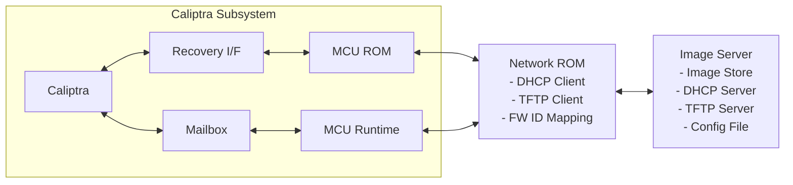
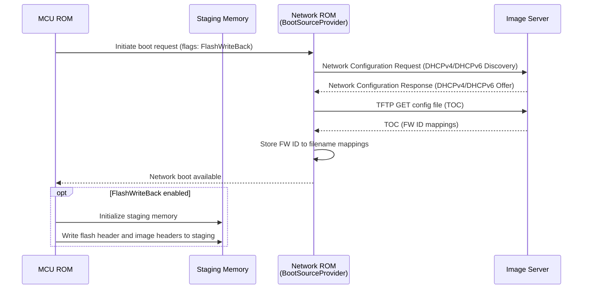
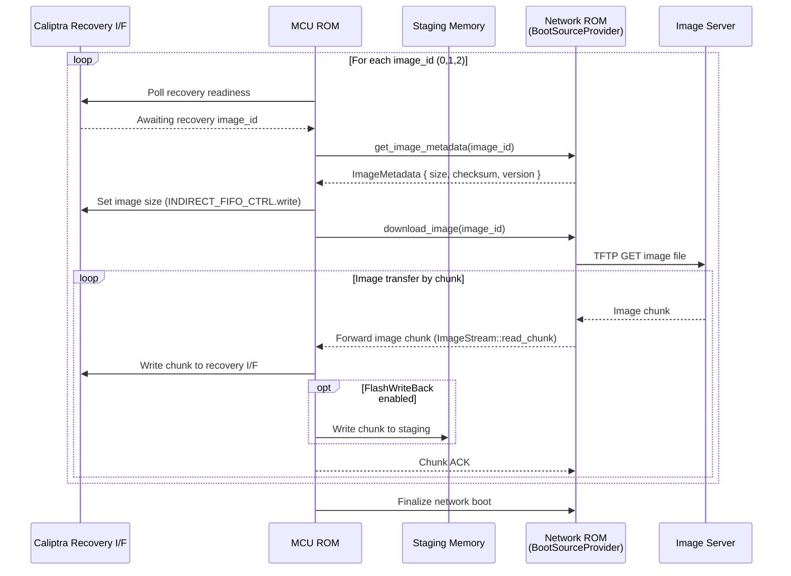
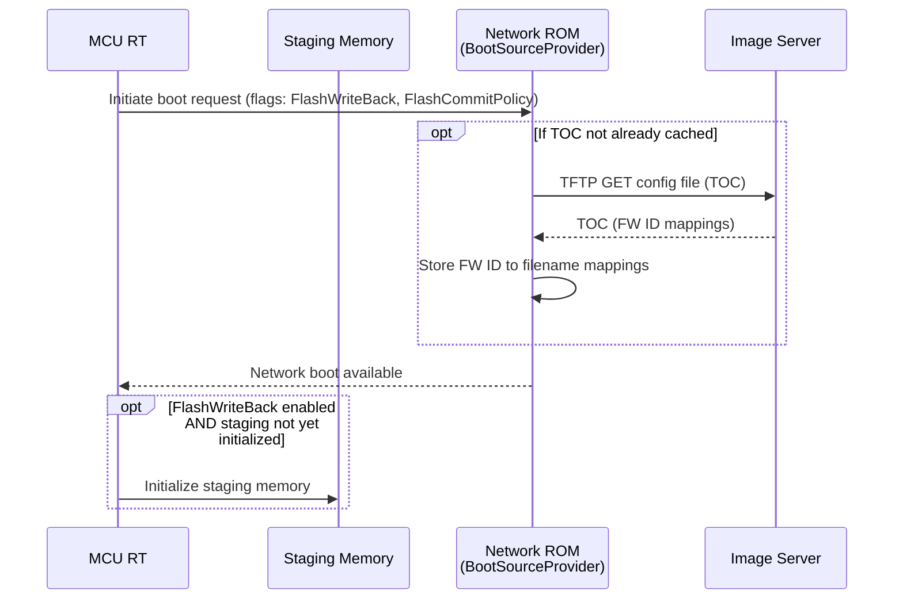
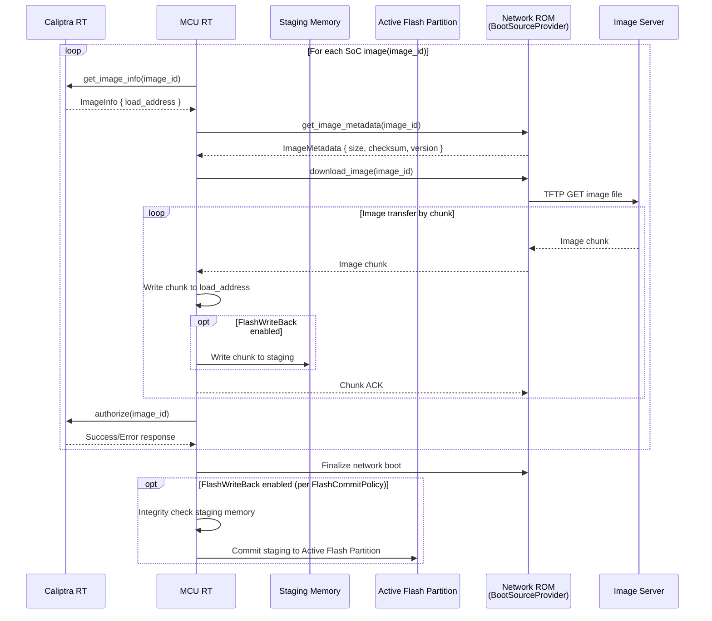

# Network Recovery Boot

This document outlines the design for a lightweight network recovery boot mechanism for the Caliptra subsystem. The system enables the Caliptra SS to download firmware images over the network through a dedicated Network Boot Coprocessor within a ROM environment, providing a resilient fallback path when flash memory is corrupted.

The network boot coprocessor acts as an intermediary between remote image servers and the Caliptra SS, handling network communications including DHCP configuration, TFTP server discovery, and firmware image downloads. The system supports downloading multiple firmware components that includes the Caliptra SS and SoC images through a firmware ID-based mapping system.

## Motivation

- **Flash Dependency Risk**: Boot failure if both flashes are corrupted
- **Recovery Challenge**: Physical intervention is costly in hyperscale environments
- **Design Goals**:
  - Minimal MCU ROM footprint
  - Consistent with OCP streaming boot model for early firmware (Caliptra FMC + RT, SoC Manifest, MCU RT)
  - Secure image retrieval
  - Resilient fallback path
- **Solution**:
  - Use a dedicated co-processor with a lightweight network stack
  - Automatically configure networking via DHCP
  - Securely download Caliptra early firmware images into the Caliptra subsystem

## System Architecture



## Network Recovery Boot Flow
### Stage 1: Booting early firmware
- **Network recovery boot initiation**
The following diagram illustrates the high-level flow using the `BootSourceProvider` interface, showing how `InitiateBoot` drives DHCP and TOC fetch:



- **Early firmware image transfer**

Once the boot source is initialized, the MCU ROM uses the `BootSourceProvider` methods to fetch each firmware component:



### Stage 2: Booting remainder firmware

This section describes the flow for loading and authenticating SoC images at runtime through the MCU Runtime. The MCU Runtime coordinates image authorization with the Caliptra Core, while Network ROM handles downloading image data from the network.

- **Network recovery boot initiation**



- **Remainder firmware images transfer**



### Flash Write-Back During Network Recovery

Flash write-back is an optional feature for flash-based systems (e.g., BMC) that persists firmware images downloaded during network recovery to the active flash partition. Without this feature, downloaded images exist only in volatile state — loaded into Caliptra/SoC via recovery I/F or load addresses — and a reboot would require another network recovery. When enabled, each image chunk received from the network is dual-written to both the primary destination (recovery I/F or load address) and a staging memory buffer (vendor choice: DRAM or flash). Once all images are authorized, a lightweight integrity check (header checksums and per-image checksum comparison against TOC metadata) is performed on the staging contents to detect write corruption — this is not a full cryptographic re-verification since the images were already verified by Caliptra on the primary path. The staging contents are then committed to the active flash partition using the same `Invalid → copy → Valid` partition status transition as the existing [firmware update](./firmware_update.md) flow. Unlike firmware update (which writes to the inactive partition for safe rollback), network recovery targets the active partition because it has already failed — there is nothing valuable to preserve, and writing directly to it ensures the next boot succeeds immediately without fallback logic or partition pointer swap.

#### Configuration

Flash write-back is controlled by two fields in the Initiate Boot Request `Flags` (offset 8):

| Bits | Field | Description |
|------|-------|-------------|
| 0 | FlashWriteBack | 0=Disabled (default), 1=Enabled |
| 1 | FlashCommitPolicy | When to commit staging memory → active flash partition |
| 2-31 | Reserved | Must be 0 |

**FlashCommitPolicy values:**

| Value | Name | When Commit Occurs |
|-------|------|-------------------|
| 0 | PostAuthorization | After all images are cryptographically authorized (default) |
| 1 | PostBootSuccess | After platform signals full boot success |

The commit policy is a **vendor policy decision**:
- **PostAuthorization** (recommended default) — all images have been cryptographically verified by Caliptra. In Stage 1, early firmware (FMC+RT, SoC Manifest, MCU RT) is verified during the Caliptra recovery boot process. In Stage 2, each SoC image is explicitly authorized by Caliptra RT. The commit to flash occurs after the last authorization succeeds, at which point the flash image is complete and fully authenticated. This aligns with the existing firmware update verification and commit flow.
- **PostBootSuccess** is more conservative — the entire system has successfully booted from the recovered images before the flash is updated. This provides the strongest guarantee that the committed image set is fully functional, but widens the window for power-loss before commit and couples flash commit to runtime behavior beyond image integrity.

Flash write-back can also be controlled as a build-time feature flag (`flash-writeback`) to compile out the staging code path entirely on platforms without writable flash.

#### Error Handling

- If any staging memory write fails during streaming, the flash write-back is abandoned — the primary boot continues normally. The staging data is discarded.
- If the integrity check fails after streaming, the staging data is not committed. The partition table is unchanged.
- If commit (staging → active flash copy) fails, the active flash partition is left marked `Invalid`.
- In all failure cases, the network recovery boot itself is **not aborted** — flash write-back is best-effort and does not gate the primary recovery path.

## Protocol Support

The boot source provider supports a minimal set of protocols optimized for the Caliptra ROM environment:

### DHCP (Dynamic Host Configuration Protocol)
- **Purpose**: Automatic network configuration
- **Advantages**:
  - Standard network configuration protocol
  - Minimal overhead for basic IP assignment
  - Simple UDP-based protocol
- **Implementation**: Client-side DHCP for IP address, gateway, and boot server discovery

### TFTP (Trivial File Transfer Protocol)
- **Purpose**: Lightweight file transfer for firmware images
- **Advantages**:
  - Extremely lightweight - minimal overhead perfect for ROM environments
  - Simple UDP-based protocol - easy to implement securely
  - Small code footprint (~5-10KB implementation)
  - Standard protocol for network boot scenarios
- **Implementation**: Client-side TFTP for firmware image download

### IPv4 and IPv6 Support
- **Dual-Stack**: Support both IPv4 and IPv6 throughout discovery and transfer
- **UDPv4/UDPv6**: TFTP runs over UDP; ensure lwIP `IPv6` and `UDP` are enabled
- **DHCPv4/DHCPv6**: Acquire network configuration via DHCP for both families
- **Address Selection**: Prefer IPv6 when available; fall back to IPv4
- **TOC URLs**: TOC entries may reference IPv4 or IPv6 hosts; support `tftp://[IPv6]` URLs

### DHCP Options for TFTP
- **DHCPv4 (RFC 2132)**
    - Option 66: TFTP server name (hostname or IP address)
    - Option 67: Bootfile name (path to TOC or image)
    - Optional: Option 43 (Vendor-Specific) for custom parameters
- **DHCPv6 (RFC 5970)**
    - Option 59: Bootfile URL (e.g., `tftp://server/path/to/toc.bin`)
    - Option 60: Bootfile Parameters (optional, for additional metadata)
    - Note: DHCPv6 does not define a separate TFTP server option; use Bootfile URL

## Boot Source Provider Interface

The Boot Source Provider Interface defines a generic contract for boot image providers, enabling support for multiple boot sources (network boot coprocessor, flash device, or other custom implementations). The MCU ROM communicates with any boot source through this unified interface.

### Messaging Protocol

The boot source provider communication uses a simple request-response messaging protocol, with the MCU ROM initiating requests and the `BootSourceProvider` responding. The following section defines the message types, packet formats, and field definitions.

### Message Types and Packet Formats

#### 1. Initiate Boot Request
Initiates the boot source discovery process.

**Request Packet:**

| Offset | Size | Field | Description |
|--------|------|-------|-------------|
| 0 | 1 | Message Type | 0x01 - InitiateBoot |
| 1 | 3 | Reserved | Must be 0 |
| 4 | 4 | Protocol Version | Version of the messaging protocol |
| 8 | 4 | Flags | Bit 0: FlashWriteBack (dual-write streamed images to staging memory), Bit 1: FlashCommitPolicy (0=PostAuthorization, 1=PostBootSuccess), Bits 2-31: Reserved |
| 12 | N | Source Specific | Source-specific initialization parameters |

**Response Packet:**

| Offset | Size | Field | Description |
|--------|------|-------|-------------|
| 0 | 1 | Message Type | 0x81 - InitiateBoot Response |
| 1 | 1 | Status | 0x00=Started, 0x01=InProgress, 0x02–0xFF=Error code |
| 2 | 2 | Reserved | Must be 0 |

#### 2. Get Image Metadata Request
Queries metadata about a specific firmware image.

**Request Packet:**

| Offset | Size | Field | Description |
|--------|------|-------|-------------|
| 0 | 1 | Message Type | 0x02 - Image Info Request |
| 1 | 1 | Firmware ID | 0=CaliptraFmcRt, 1=SocManifest, 2=McuRt, 0x10000000..-SoC |
| 2 | 2 | Reserved | Must be 0 |

**Response Packet:**

| Offset | Size | Field | Description |
|--------|------|-------|-------------|
| 0 | 1 | Message Type | 0x82 - Image Info Response |
| 1 | 1 | Status | 0x00=Success, non-zero=Error |
| 2 | 2 | Reserved | Must be 0 |
| 4 | 4 | Image Size | Total size in bytes |
| 8 | 32 | Checksum | Checksum of the image |
| 40 | 4 | Version | Image version number |
| 44 | 4 | Flags | Bit 0: Compressed, Bit 1: Signed, etc. |
| 48 | 4 | Reserved | For future use |

#### 3. Image Download Request
Initiates download of a firmware image. The image is transferred in chunks. The MCU ROM and BootSourceProvider should share a fixed CHUNK_SIZE configuration to indicate the maximum number of bytes that can be transferred in a chunk.

**Request Packet:**

| Offset | Size | Field | Description |
|--------|------|-------|-------------|
| 0 | 1 | Message Type | 0x03 - Image Download Request |
| 1 | 1 | Firmware ID | 0=CaliptraFmcRt, 1=SocManifest, 2=McuRt, 0x10000000..-SoC |
| 2 | 2 | Reserved | Must be 0 |
| 4 | 4 | Reserved | Can be extended to support flash-based boot |
| 8 | 4 | Reserved | Can be extended to support flash-based boot |

**Response Packet (per chunk):**

| Offset | Size | Field | Description |
|--------|------|-------|-------------|
| 0 | 1 | Message Type | 0x83 - Image Chunk |
| 1 | 1 | Status | 0x00=Success, non-zero=Error |
| 2 | 2 | Sequence Number | For ordered delivery |
| 4 | 4 | Offset | Current byte offset in image |
| 8 | 4 | Chunk Size | Size of data in this chunk. If value is less than CHUNK_SIZE, then this is the last chunk. |
| 12 | N | Image Data | Chunk payload (size = Chunk Size field) |

#### 4. Chunk Acknowledgment
Acknowledges receipt of an image chunk and provides flow control.

**Request Packet:**

| Offset | Size | Field | Description |
|--------|------|-------|-------------|
| 0 | 1 | Message Type | 0x04 - Chunk ACK |
| 1 | 1 | Firmware ID | Firmware being transferred |
| 2 | 2 | Sequence Number | Sequence number to be acknowledged |
| 4 | 4 | Reserved | |
| 8 | 4 | Flags | Bit 0: Ready for next, Bit 1: Error detected |

#### 5. Finalize
Notifies the boot source of recovery completion or error. This allows the `BootSourceProvider` to free up any allocated resources, terminate connections and stop services (if any).

**Request Packet:**

| Offset | Size | Field | Description |
|--------|------|-------|-------------|
| 0 | 1 | Message Type | 0x05 - Finalize |
| 1 | 1 | Status | 0x00=Success, non-zero=Error |
| 2 | 2 | Error Code | Specific error code if Status != 0 |
| 4 | 4 | Reserved | For future use |

**Response Packet:**

| Offset | Size | Field | Description |
|--------|------|-------|-------------|
| 0 | 1 | Message Type | 0x85 - Finalize ACK |
| 1 | 1 | Status | 0x00=Acknowledged, non-zero=Error |
| 2 | 2 | Reserved | Must be 0 |
| 4 | 4 | Cleanup Flags | Bit 0: Clear TOC, Bit 1: Reset connection |
| 8 | 4 | Reserved | For future use |

### Message Summary Table

| Message Type | Code | Direction | Purpose |
|-------|------|-----------|---------|
| Initiate Boot Request | 0x01 | MCU → Source | Initiate boot source discovery |
| Initiate Boot Response | 0x81 | Source → MCU | Confirm discovery and image availability |
| Image Metadata Request | 0x02 | MCU → Source | Query image metadata |
| Image Metadata Response | 0x82 | Source → MCU | Return image metadata and checksums |
| Image Download Request | 0x03 | MCU → Source | Start image transfer |
| Image Chunk | 0x83 | Source → MCU | Send image data chunk |
| Chunk ACK | 0x04 | MCU → Source | Acknowledge chunk and flow control |
| Finalize | 0x05 | MCU → Source | Notify recovery completion/error |
| Finalize ACK | 0x85 | Source → MCU | Final acknowledgment |

### Error Codes

```
Error Code  Description
----------  -----------
0x00        Success / No Error
0x01        Invalid Message Type
0x02        Invalid Firmware ID
0x03        Image Not Found / Not Available
0x04        Checksum Mismatch
0x05        Transfer Timeout
0x06        Source Not Ready
0x07        Invalid Parameters
0x08        Corrupted Data
0x09        Insufficient Space
0x0A        Checksum Verification Failed
0x0B        Flash Write Failed
0x0C        Flash Staging Not Available
0x0D        Flash Commit Failed
0x0E        Flash Verification Failed
0xFF        Unknown / Unspecified Error
```

### Core Operations

Boot source providers implement the following core operations:

#### Initialization
- **Source Initialization**: Initialize the boot source and make it ready for image requests
- **Status Discovery**: Determine availability and readiness of the boot source
- **Configuration Discovery**: Discover firmware image metadata and availability

#### Image Provisioning
- **Image Metadata Query**: Query information about available firmware images (size, checksums, etc.)
- **Image Download**: Download firmware images by firmware ID
- **Data Streaming**: Stream image data to the MCU ROM for direct transfer to Caliptra SS

#### Supported Firmware IDs
- **ID 0**: Caliptra FMC+RT image
- **ID 1**: SoC Manifest
- **ID 2**: MCU RT image
- **ID 0x10000000 - 0x1FFFFFFF**: Reserved for SoC Images (range supports up to 268,435,456 distinct SoC image IDs)

### Boot Source Provider Interface

```rust
/// Boot configuration flags passed to initiate_boot
#[derive(Debug, Clone, Copy, Default)]
pub struct BootFlags {
    /// When true, streamed image chunks are also dual-written to staging memory
    pub flash_writeback: bool,
    /// Controls when staging memory is committed to active flash partition
    pub flash_commit_policy: FlashCommitPolicy,
}

/// Defines when staging memory is committed to the active flash partition (vendor policy)
#[derive(Debug, Clone, Copy, Default)]
pub enum FlashCommitPolicy {
    /// Commit after all images are cryptographically verified/authorized (recommended)
    #[default]
    PostAuthorization = 0,
    /// Commit after the platform signals full boot success
    PostBootSuccess = 1,
}

/// Generic boot source provider interface for the MCU ROM
/// This interface abstracts different boot sources (network, flash, etc.)
pub trait BootSourceProvider {
    type Error;

    /// Initialize the boot source
    /// This performs source-specific initialization (e.g., DHCP for network, etc.)
    /// `flags` controls optional behaviors like flash write-back
    fn initiate_boot(&mut self, flags: BootFlags) -> Result<BootSourceStatus, Self::Error>;

    /// Get information about a firmware image
    fn get_image_metadata(&self, firmware_id: FirmwareId) -> Result<ImageInfo, Self::Error>;

    /// Download firmware image by ID
    /// Returns a stream for reading image data in chunks
    fn download_image(&mut self, firmware_id: FirmwareId) -> Result<ImageStream, Self::Error>;

    /// Get boot source status and capabilities
    fn get_boot_source_status(&self) -> Result<BootSourceStatus, Self::Error>;

    /// Deinitialize the boot source
    fn finalize(&self) -> Result<BootSourceStatus, Self::Error>;
}

/// Firmware ID enumeration
#[derive(Debug, Clone, Copy)]
pub enum FirmwareId {
    /// Caliptra FMC+RT image
    CaliptraFmcRt = 0,
    /// SoC Manifest
    SocManifest = 1,
    /// MCU RT image
    McuRt = 2,
    /// SoC Image (raw u32 value in range 0x10000000 - 0x1FFFFFFF)
    SocImage(u32),
}

/// Boot source initialization and capability status
#[derive(Debug)]
pub struct BootSourceStatus {
    pub ready: bool,
    pub initialized: bool,
    pub config_available: bool,
    pub available_images: Vec<u32>,
}

/// Metadata for a firmware image
#[derive(Debug, Clone)]
pub struct ImageInfo {
    pub firmware_id: FirmwareId,
    pub size: u64,
    pub checksum: Option<[u8; 32]>,
    pub version: Option<u32>,
    pub metadata: Vec<u8>,
}

/// Streaming interface for image data
pub trait ImageStream {
    /// Read next chunk of image data
    fn read_chunk(&mut self, buffer: &mut [u8]) -> Result<usize, Error>;

    /// Get total image size if known
    fn total_size(&self) -> Option<u64>;

    /// Check if stream is complete
    fn is_complete(&self) -> bool;
}
```

### Implementation Example: Network Boot Coprocessor

For a network boot coprocessor implementation, the boot source provider would:

1. **Initialize**: Perform DHCP discovery, locate TFTP server, download TOC
2. **Get Image Metadata**: Query image metadata from downloaded TOC
3. **Download Image**: Fetch image from TFTP server and stream to MCU ROM

```rust
/// Network-based boot source provider implementation
pub struct NetworkBootSource {
    dhcp_client: DhcpClient,
    tftp_client: TftpClient,
    toc: TableOfContents,
}

impl BootSourceProvider for NetworkBootSource {
    type Error = NetworkBootError;

    fn initiate_boot(&mut self, _flags: BootFlags) -> Result<BootSourceStatus, Self::Error> {
        // 1. Perform DHCP discovery
        self.dhcp_client.discover()?;

        // 2. Download TOC via TFTP
        self.toc = self.tftp_client.download_config()?;

        Ok(BootSourceStatus {
            ready: true,
            initialized: true,
            config_available: true,
            available_images: self.toc.firmware_mappings.keys().copied().collect(),
        })
    }

    fn get_image_metadata(&self, firmware_id: FirmwareId) -> Result<ImageInfo, Self::Error> {
        let mapping = self.toc.get_mapping(firmware_id)?;
        Ok(ImageInfo {
            firmware_id,
            size: mapping.size,
            checksum: mapping.checksum,
            version: mapping.version.clone(),
        })
    }

    fn download_image(&mut self, firmware_id: FirmwareId) -> Result<ImageStream, Self::Error> {
        let mapping = self.toc.get_mapping(firmware_id)?;
        self.tftp_client.get_file(&mapping.filename)
    }

    fn get_boot_source_status(&self) -> Result<BootSourceStatus, Self::Error> {
        // Return current network and TFTP status
        Ok(BootSourceStatus {
            ready: self.tftp_client.is_reachable(),
            initialized: true,
            config_available: true,
            available_images: self.toc.firmware_mappings.keys().copied().collect(),
        })
    }

    fn finalize(&self) -> Result<BootSourceStatus, Self::Error> {
        Ok(BootSourceStatus::Success)
    }
}
```

### Usage Example

```rust
// Example: MCU ROM boot process using generic boot source
fn recovery_boot(mut boot_source: &mut dyn BootSourceProvider) -> Result<(), Error> {
    // 1. Initialize boot source
    let status = boot_source.initiate_boot()?;

    if !status.ready || !status.initialized {
        return Err(Error::BootSourceNotAvailable);
    }

    // 2. Download each firmware image
    for firmware_id in [FirmwareId::CaliptraFmcRt, FirmwareId::SocManifest, FirmwareId::McuRt] {
        // Get image metadata
        let image_info = boot_source.get_image_metadata(firmware_id)?;

        // Set up recovery interface with image size
        set_recovery_image_size(image_info.size)?;

        // Download image
        let mut stream = boot_source.download_image(firmware_id)?;

        // Stream image chunks to recovery interface
        load_image_stream(stream, ImageDestination::Recovery)?;
    }

    // 3. Finalize recovery
    boot_source.finalize()?;

    Ok(())
}

fn load_image_stream(mut stream: ImageStream, dest: ImageDestination) -> Result<(), Error> {
    let mut buffer = [0u8; 4096];

    while !stream.is_complete() {
        let bytes_read = stream.read_chunk(&mut buffer)?;
        if bytes_read > 0 {
            write_image_chunk(dest, &buffer[..bytes_read])?;
        }
    }
    Ok(())
}
```

### Configuration File Format (TOC - Table of Contents)

During network boot, the coprocessor first downloads a Table of Contents (TOC) configuration file. This file maps firmware IDs to their corresponding filenames and metadata, allowing the boot process to locate and retrieve the correct firmware images. The TOC follows the same format used for FLASH storage, as described in the [Flash Layout specification](./flash_layout.md).

## Network Stack Implementation

**lwIP (Lightweight IP)** will be used with Rust bindings/wrappers to support DHCP and TFTP

**Repository**: https://git.savannah.nongnu.org/cgit/lwip.git
