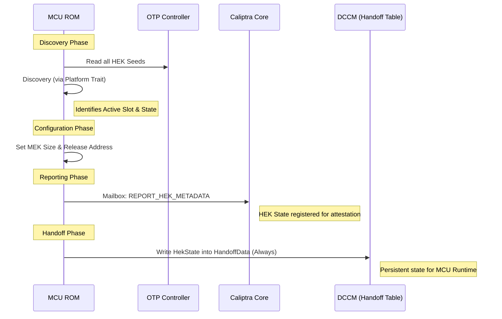

# OCP LOCK Integrator Guide

OCP LOCK (Layered Open-source Cryptographic Key management) is a specification for secure key management for Data-At-Rest protection in self-encrypting storage devices. This guide provides technical details for integrators to implement and customize the OCP LOCK functionality within the MCU project while maintaining compliance with the OCP LOCK specification.

## Overview

OCP LOCK acts as a Key Management Block (KMB), serving as the only entity capable of reading Media Encryption Keys (MEKs) and programming them into a vendor-implemented encryption engine. 

### Core Components

- **`romtime::ocp_lock`**: Contains platform-agnostic logic and types (defined in `romtime/src/ocp_lock.rs`).
- **`Platform` Trait**: An interface for platform-specific behavior (e.g., slot count, state transitions).
- **ROM Integration**: The MCU ROM populates HEK seeds and configures key release registers during the boot flow.

## Compliance Requirements

Integrators MUST ensure their implementation adheres to the requirements defined in the OCP LOCK specification version they are targeting.

## Implementation for Integrators

Integrators are encouraged to modify and extend the provided implementation to suit their hardware, provided the resulting system complies with the requirements set forth by the OCP LOCK specification.

### The `Platform` Trait

The `Platform` trait (in `romtime/src/ocp_lock.rs`) is the primary extension point:

```rust
pub trait Platform {
    /// Total number of HEK Seed Slots available in OTP.
    fn get_total_slots(&self) -> usize;

    /// Returns the current state of a specific HEK Seed slot.
    fn get_slot_state(
        &mut self,
        otp: &crate::otp::Otp,
        perma_bit: &PermaBitStatus,
        slot: usize,
        seed: &[u8; 48],
    ) -> Result<HekSeedState, Error>;

    /// Determines the active HEK slot based on platform-specific policy.
    fn get_active_slot(
        &mut self,
        otp: &crate::otp::Otp,
        perma_bit: &PermaBitStatus,
        seeds: &HekSeeds,
    ) -> Result<usize, Error>;
}
```

### HEK Seed States

HEK Seed states are defined by the EKP spec. The MCU runtime uses this spec for attestation and state management. MCU uses a simplified state for communicating to KMB. The simplified states are defined in the OCP LOCK specification and are compatible with the expanded states defined in EKP.

## ROM Boot Flow

The MCU ROM manages the OCP LOCK lifecycle during the cold boot process. The flow is designed to discover the current state of the Hardware Encryption Key (HEK) seeds and communicate this state to both the Caliptra Core and the MCU Runtime.

### OCP LOCK Initialization Sequence

1.  **Discovery**: ROM reads all HEK seeds from the OTP controller and uses the `Platform` trait to determine their states and identify the active slot.
2.  **Configuration**: ROM programs the Media Encryption Key (MEK) size and target release address into the Hardware Encryption Engine's control registers.
3.  **Handoff Preparation**: The discovered `HekState` is captured. This state includes the active slot index, the state of that slot (e.g., `Programmed`, `Permanent`), and the total number of available slots.
4.  **Metadata Reporting**: ROM sends the `REPORT_HEK_METADATA` command to the Caliptra Core, providing it with the OCP LOCK status for attestation purposes.
5.  **State Handoff**: The `HekState` is stored in the `HandoffData` structure in DCCM. This ensures the MCU Runtime can later access the OCP LOCK status without re-performing discovery.

### OCP LOCK Flow Diagram



## Handoff Mechanism

The OCP LOCK state is a critical part of the system's security posture. To ensure consistency, the ROM **always** writes the OCP LOCK state into the handoff table.

- **`HekState`**: Contains `active_state`, `active_slot`, and `total_slots`.

## References

- [OCP LOCK Specification](https://github.com/chipsalliance/Caliptra/tree/main/doc/ocp_lock)
