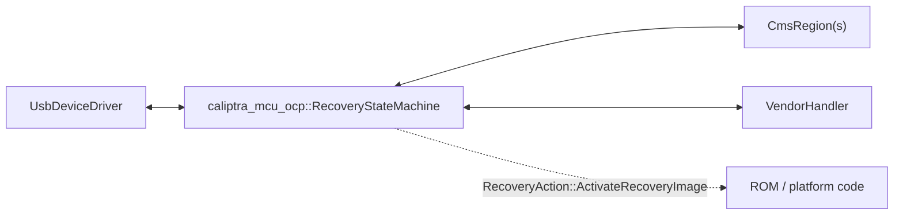

# OCP Recovery Integrator Guide (Optional)

The `caliptra_mcu_ocp` crate (`common/ocp`) is an **optional** convenience library for implementing the
[OCP Secure Firmware Recovery](https://www.opencompute.org/documents/ocp-secure-firmware-recovery-specification)
specification. It provides a transport-agnostic protocol state machine so an integrator only has to supply
hardware and vendor specific pieces. This OCP functionality complements the existing
[I3C Boot Mechanism](./dot_i3c.md) by allowing integrators which supply their own Peripherals (USB, SMBUS,
etc.) to tie into the boot system as well.

This guide explains how to integrate a peripheral (today: a USB device controller) with `common/ocp`,
using the emulator's reference implementation as an example.

## Overview

An OCP Recovery agent built on `common/ocp` has two halves:

- **The library** owns protocol state: it parses `RecoveryCommand`s, serializes descriptor and status
  responses, and tracks OCP state.
- **The integrator** owns the transport driver as well as defining the supported functionalities, and
  vendor specific commands. If custom backed CMS Regions (flash, etc.) are to be used the integrator is
  also responsible for them.

The two halves communicate through four traits defined in `common/ocp`: `UsbDeviceDriver`,
`IndirectCmsRegion`, `FifoCmsRegion`, and `VendorHandler`.

### Architecture at a glance



The library owns the middle box (`RecoveryStateMachine`); everything else is supplied by the integrator.
`ExamplarUsbDriver` is the reference `UsbDeviceDriver` implementation, at
[`platforms/emulator/rom/usb/src/lib.rs`](https://github.com/chipsalliance/caliptra-mcu-sw/tree/main-2.1/platforms/emulator/rom/usb/src/lib.rs).

## What you implement

### `UsbDeviceDriver` — the peripheral driver

This is the core abstraction of the OCP Software library. Currently this implementation is aimed at USB
Peripheral devices, but can be extended to support other transport protocols.

The basic functionality defined within the trait is how to initialize, receive a request, send a response,
and stall the endpoint. The integrator is responsible for all specifics on how the endpoint itself
correlates into a full OCP packet.

For more detailed documentation checkout
[UsbDeviceDriver](https://github.com/chipsalliance/caliptra-mcu-sw/tree/main-2.1/common/ocp/src/usb/driver.rs#L112).

### `VendorHandler` — device-specific callbacks (optional)

This abstraction serves to allow the Vendor to customize the capabilities of the OCP implementation being
provided. This includes defining a custom Vendor Command, as well as hardware specific capabilities like
heartbeat, etc. If a vendor wishes to use a stock implementation a
[NoopVendorHandler](https://github.com/chipsalliance/caliptra-mcu-sw/blob/main-2.1/common/ocp/src/vendor.rs#L93)
is provided which configures a minimal recovery library.

For more detailed documentation checkout
[VendorHandler](https://github.com/chipsalliance/caliptra-mcu-sw/blob/main-2.1/common/ocp/src/vendor.rs#L44)

### `IndirectCmsRegion` / `FifoCmsRegion` — CMS storage backends

Defined in `common/ocp/src/cms.rs`. The OCP spec defines two access models for a CMS region, and
`common/ocp` defines one trait per model:

- `IndirectCmsRegion`: random-access, offset-based reads/writes (`INDIRECT_CTRL` / `INDIRECT_STATUS` /
  `INDIRECT_DATA`).
- `FifoCmsRegion`: streaming producer/consumer I/O with internal index tracking (`INDIRECT_FIFO_CTRL` /
  `INDIRECT_FIFO_STATUS` / `INDIRECT_FIFO_DATA`).

The library provides implementations for memory backed (aka Slice) implementations of both region
semantics. The operations are also generic via the IndirectCmsRegion and FifoCmsRegion traits which can be
implemented to support alternatively backed regions, for example Flash, or hardware FIFOs.

Detailed documentation can be found in the
[cms folder](https://github.com/chipsalliance/caliptra-mcu-sw/tree/main-2.1/common/ocp/src/cms).

## Wiring it together

The three trait implementations, plus a `RecoveryDeviceConfig` (device identity, protocol version, response
timeout, heartbeat period), are assembled into a `RecoveryStateMachine`:

```rust
let mut sm = RecoveryStateMachine::new(
    config,              // RecoveryDeviceConfig
    &mut usb_driver,      // impl UsbDeviceDriver
    &mut indirect_regions, // &mut [(u8, &mut dyn IndirectCmsRegion)]
    &mut fifo_regions,     // &mut [(u8, &mut dyn FifoCmsRegion)]
    vendor_handler,        // impl VendorHandler
)?;
```

To actually drive ROM boot from this state machine, wrap it in the ROM's `OcpImageProvider` (which
implements the ROM's `ImageProvider` trait), register it with an `ImageProviderManager`, and hand that
manager to `RomParameters`:

```rust
use caliptra_mcu_rom_common::recovery::ocp::OcpImageProvider;
use caliptra_mcu_rom_common::recovery::{ErrorPolicy, ImageProviderEntry, ImageProviderManager};

// Adapts the RecoveryStateMachine to the ROM's ImageProvider trait.
let mut ocp_provider = OcpImageProvider::new(sm);

// ImageProviderManager tries entries in order, honoring each one's ErrorPolicy
// (Continue, Retry(n), or RetryForever) before advancing to the next.
let mut entries = [ImageProviderEntry {
    provider: &mut ocp_provider,
    policy: ErrorPolicy::RetryForever, // keep waiting on USB recovery
}];
let manager = ImageProviderManager::new(&mut entries);

caliptra_mcu_rom_common::rom_start(RomParameters {
    image_provider_manager: Some(manager),
    ..Default::default()
})?;
```

`ImageProviderEntry` array can hold more than one provider (e.g. an I3C DOT provider ahead of the OCP one) —
`ImageProviderManager` walks them in order, so OCP recovery can be a fallback alongside other transports
rather than the only recovery path.
