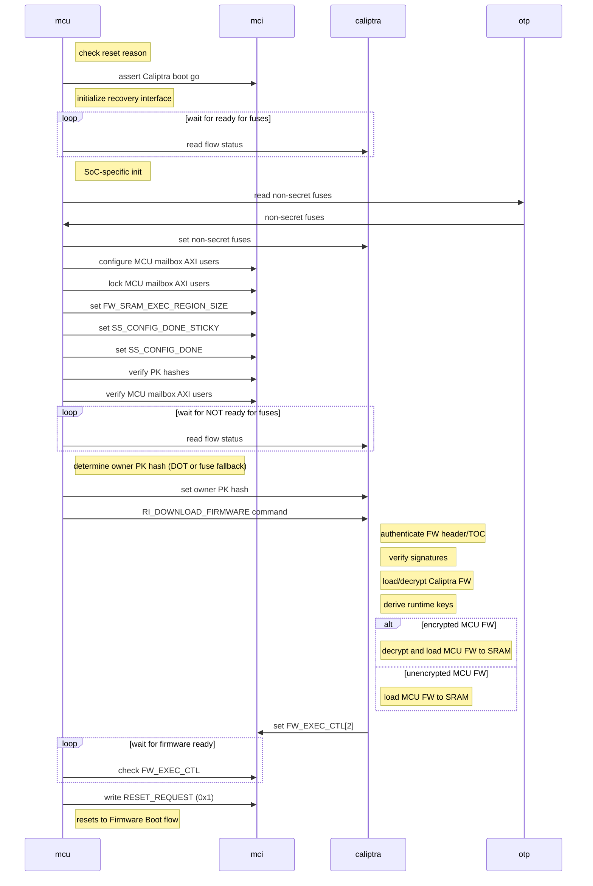
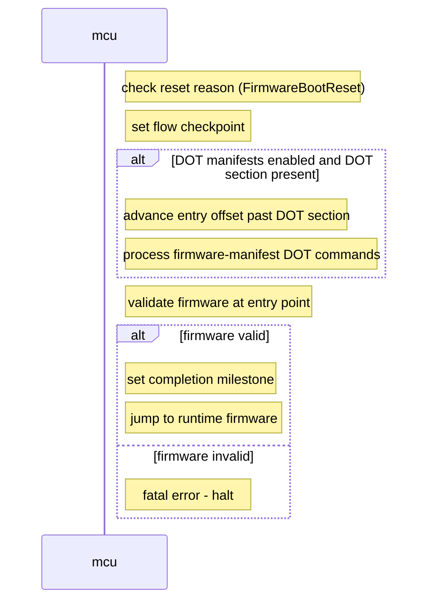
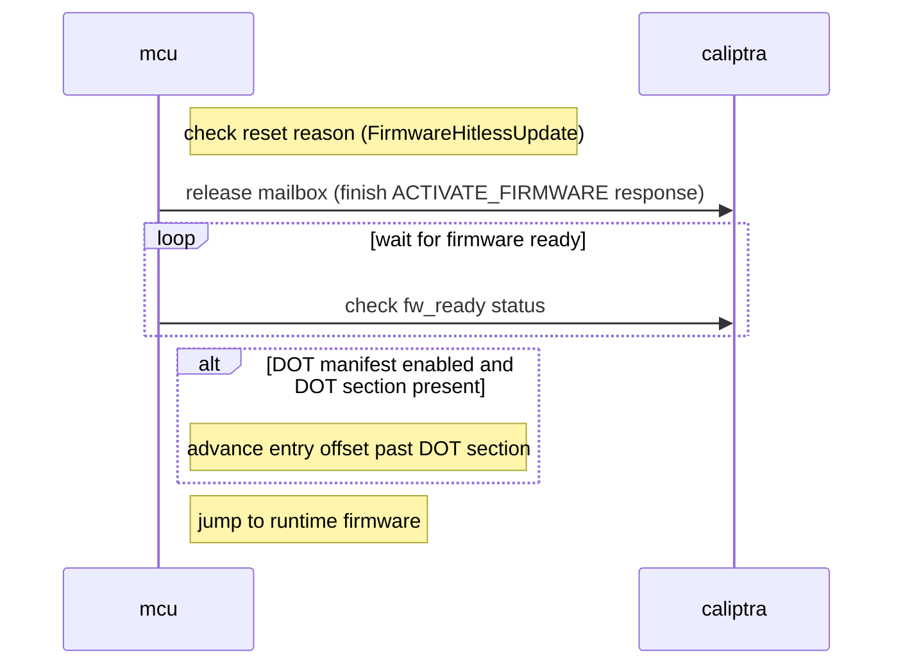
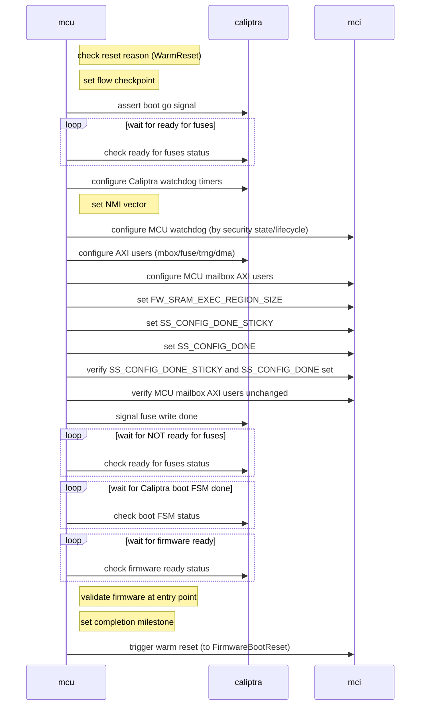

# Reference ROM Specification

The reference ROM is executed when the MCU starts.

The ROM's main responsibilities to the overall Caliptra subsystem are to:

* Send non-secret fuses to Caliptra core
* Initialize I3C and the firmware recovery interface
* Jump to firmware

It can also handle any other custom SoC-specific initialization that needs to happen early.

## Boot Flows

There are three main boot flows that needs to execute for its role in the Caliptra subsystem:

* Cold Boot Flow
* Firmware Update Flow
* Warm Reset Flow

These are selected based on the MCI `RESET_REASON` register that is set by hardware whenver the MCU is reset.

### Cold Boot Flow

1. Check the MCI `RESET_REASON` register for MCU status (it should be in cold boot mode)
1. Initialize I3C recovery interface. For AXI bypass boot, only the recovery interface initialization is required; basic I3C initialization can be skipped.
   * For I3C boot: Initialize I3C registers according to the [initialization sequence](https://chipsalliance.github.io/i3c-core/initialization.html), then initialize I3C recovery interface per the [recovery flow](https://chipsalliance.github.io/i3c-core/recovery_flow.html).
   * For AXI bypass boot: Only initialize the recovery interface registers needed for streaming boot.
1. Assert Caliptra boot go signal to bring Caliptra out of reset.
1. Read Caliptra SoC `FLOW_STATUS` register to wait for Caliptra Ready for Fuses state.
1. Anything SoC-specific can happen here
1. Read non-secret fuses from the OTP controller. The authoritative fuse map is contained in [the main Caliptra specification](https://github.com/chipsalliance/Caliptra/blob/main/doc/Caliptra.md#fuse-map).
1. Write fuse data to Caliptra SoC interface fuse registers. The following fuses are written to the corresponding Caliptra registers:
    * [`FUSE_PQC_KEY_TYPE`](https://chipsalliance.github.io/caliptra-rtl/main/internal-regs/?p=clp.soc_ifc_reg.fuse_pqc_key_type): Vendor PQC key type (2 bits)
    * [`FUSE_FMC_KEY_MANIFEST_SVN`](https://chipsalliance.github.io/caliptra-rtl/main/internal-regs/?p=clp.soc_ifc_reg.fuse_soc_manifest_svn%5B0%5D): FMC key manifest SVN (32 bits)
    * [`FUSE_VENDOR_PK_HASH`](https://chipsalliance.github.io/caliptra-rtl/main/internal-regs/?p=clp.soc_ifc_reg.fuse_vendor_pk_hash%5B0%5D): Vendor public key hash (384 bits)
    * [`FUSE_RUNTIME_SVN`](https://chipsalliance.github.io/caliptra-rtl/main/internal-regs/?p=clp.soc_ifc_reg.fuse_runtime_svn%5B0%5D): Runtime SVN (128 bits)
    * [`FUSE_SOC_MANIFEST_SVN`](https://chipsalliance.github.io/caliptra-rtl/main/internal-regs/?p=clp.soc_ifc_reg.fuse_soc_manifest_svn): SoC manifest SVN (128 bits)
    * [`FUSE_SOC_MANIFEST_MAX_SVN`](https://chipsalliance.github.io/caliptra-rtl/main/internal-regs/?p=clp.soc_ifc_reg.fuse_soc_manifest_max_svn): SoC manifest max SVN (32 bits)
    * [`FUSE_MANUF_DBG_UNLOCK_TOKEN`](https://chipsalliance.github.io/caliptra-rtl/main/internal-regs/?p=clp.soc_ifc_reg.fuse_manuf_dbg_unlock_token): Manufacturing debug unlock token (128 bits)
    * [`FUSE_ECC_REVOCATION`](https://chipsalliance.github.io/caliptra-rtl/main/internal-regs/?p=clp.soc_ifc_reg.fuse_ecc_revocation): Vendor ECC key revocation (4 bits)
    * [`FUSE_LMS_REVOCATION`](https://chipsalliance.github.io/caliptra-rtl/main/internal-regs/?p=clp.soc_ifc_reg.fuse_lms_revocation): Vendor LMS key revocation (32 bits)
    * [`FUSE_MLDSA_REVOCATION`](https://chipsalliance.github.io/caliptra-rtl/main/internal-regs/?p=clp.soc_ifc_reg.fuse_mldsa_revocation): Vendor MLDSA key revocation (4 bits)
    * [`CPTRA_OWNER_PK_HASH`](https://chipsalliance.github.io/caliptra-rtl/main/internal-regs/?p=clp.soc_ifc_reg.CPTRA_OWNER_PK_HASH): Owner public key hash (384 bits, written only if non-zero, could be overridden by [device ownership transfer](dot.md))
    * [`FUSE_SOC_STEPPING_ID`](https://chipsalliance.github.io/caliptra-rtl/main/internal-regs/?p=clp.soc_ifc_reg.fuse_soc_stepping_id): SoC stepping ID (16 bits)
    * [`FUSE_ANTI_ROLLBACK_DISABLE`](https://chipsalliance.github.io/caliptra-rtl/main/internal-regs/?p=clp.soc_ifc_reg.fuse_anti_rollback_disable): Anti-rollback disable (1 bit)
    * [`FUSE_IDEVID_CERT_ATTR`](https://chipsalliance.github.io/caliptra-rtl/main/internal-regs/?p=clp.soc_ifc_reg.fuse_idevid_cert_attr): IDevID certificate attributes (768 bits)
    * [`FUSE_IDEVID_MANUF_HSM_ID`](https://chipsalliance.github.io/caliptra-rtl/main/internal-regs/?p=clp.soc_ifc_reg.fuse_idevid_manuf_hsm_id): IDevID manufacturing HSM identifier (128 bits)
    * [`SS_UDS_SEED_BASE_ADDR_L/H`](https://chipsalliance.github.io/caliptra-rtl/main/internal-regs/?p=clp.soc_ifc_reg.SS_UDS_SEED_BASE_ADDR_L): UDS/FE partition base address in OTP
    * [`SS_STRAP_GENERIC[0]`](https://chipsalliance.github.io/caliptra-rtl/main/internal-regs/?p=clp.soc_ifc_reg.SS_STRAP_GENERIC): OTP DAI idle bit offset (bits\[31:16\])
    * [`SS_STRAP_GENERIC[1]`](https://chipsalliance.github.io/caliptra-rtl/main/internal-regs/?p=clp.soc_ifc_reg.SS_STRAP_GENERIC): OTP direct access command register offset
    * [`SS_STRAP_GENERIC[2]`](https://chipsalliance.github.io/caliptra-rtl/main/internal-regs/?p=clp.soc_ifc_reg.SS_STRAP_GENERIC): iTRNG health test window size from OTP (bits\[15:0\]) and bypass mode flag (bit\[31\], from ROM parameters)
    * [`CPTRA_I_TRNG_ENTROPY_CONFIG_0`](https://chipsalliance.github.io/caliptra-rtl/main/internal-regs/?p=clp.soc_ifc_reg.CPTRA_I_TRNG_ENTROPY_CONFIG_0): iTRNG entropy configuration word 0, from OTP `cptra_itrng_entropy_config_0`
    * [`CPTRA_I_TRNG_ENTROPY_CONFIG_1`](https://chipsalliance.github.io/caliptra-rtl/main/internal-regs/?p=clp.soc_ifc_reg.CPTRA_I_TRNG_ENTROPY_CONFIG_1): iTRNG entropy configuration word 1, from OTP `cptra_itrng_entropy_config_1`
    * [MCI] [`PROD_DEBUG_UNLOCK_PK_HASH_REG`](https://chipsalliance.github.io/caliptra-ss/main/regs/?p=soc.mci_top.mci_reg.PROD_DEBUG_UNLOCK_PK_HASH_REG%5B0%5D%5B0%5D) Production debug unlock public key hashes (384 bytes total for 8 key hashes)
    * [`SS_PROD_DEBUG_UNLOCK_AUTH_PK_HASH_REG_BANK_OFFSET`](https://chipsalliance.github.io/caliptra-rtl/main/internal-regs/?p=clp.soc_ifc_reg.SS_PROD_DEBUG_UNLOCK_AUTH_PK_HASH_REG_BANK_OFFSET): Offset of `PROD_DEBUG_UNLOCK_PK_HASH_REG` within the MCI register bank (`0x480`). Caliptra ROM reads the expected hash for debug level `N` from `MCI_BASE + offset + (N - 1) * 48`.
    * [`SS_NUM_OF_PROD_DEBUG_UNLOCK_AUTH_PK_HASHES`](https://chipsalliance.github.io/caliptra-rtl/main/internal-regs/?p=clp.soc_ifc_reg.SS_NUM_OF_PROD_DEBUG_UNLOCK_AUTH_PK_HASHES): Number of production debug unlock PK hashes available (defaults to the number of entries in the reference fuse map, 8; overridable via the `prod_debug_unlock_auth_pk_hash_count` ROM parameter).
    * See [the ROM fuses](rom-fuses.md) documentation for details on how these are read and interpreted.
1. Configure MCU mailbox AXI users (see [Security Configuration](#security-configuration) below).
1. Set mailbox AXI user lock registers.
1. [2.1] Set [FC_FIPS_ZEROZATION](https://chipsalliance.github.io/caliptra-ss/main/regs/?p=soc.mci_top.mci_reg.FC_FIPS_ZEROZATION) to the appropriate value.
1. Configure the MCU SRAM execution region size by writing to the `FW_SRAM_EXEC_REGION_SIZE` register. If not specified in `RomParameters`, it defaults to reserving 32KB at the top of SRAM for the Protected Data Region.
1. Set `SS_CONFIG_DONE_STICKY`, `SS_CONFIG_DONE` registers to lock MCI configuration.
1. Verify PK hashes and MCU mailbox AXI users after locking (see [Security Configuration](#security-configuration) below).
1. Poll on Caliptra `FLOW_STATUS` registers for Caliptra to deassert the Ready for Fuses state.
1. **Determine owner public key hash.** The ROM determines which owner public key hash to write to Caliptra's [`CPTRA_OWNER_PK_HASH`](https://chipsalliance.github.io/caliptra-rtl/main/internal-regs/?p=clp.soc_ifc_reg.CPTRA_OWNER_PK_HASH) register. The source depends on whether [Device Ownership Transfer (DOT)](./dot.md) is configured and the current DOT state:
    1. **DOT configured and DOT blob present**: The ROM runs the full DOT flow — derives the `DOT_EFFECTIVE_KEY`, verifies the DOT blob's HMAC, and determines the owner from the blob's state:
        * **Locked state (ODD, blob has CAK)**: The Code Authentication Key (CAK) from the DOT blob is used as the owner PK hash.
        * **Disabled state (ODD, no CAK)**: The DOT blob is authentic but contains no CAK. The ROM falls back to reading `CPTRA_SS_OWNER_PK_HASH` from OTP fuses.
        * **EVEN state (Uninitialized/Volatile)**: DOT does not provide a persistent owner. The ROM falls back to reading `CPTRA_SS_OWNER_PK_HASH` from OTP fuses.
    1. **DOT blob empty or corrupt in Locked (ODD) state**: The ROM attempts DOT recovery (challenge/response or backup blob, depending on the platform's recovery policy). If recovery fails, this is a fatal error.
    1. **DOT not configured**: The ROM skips DOT entirely and reads the owner PK hash from `CPTRA_SS_OWNER_PK_HASH` in OTP.

    In summary, `CPTRA_SS_OWNER_PK_HASH` in OTP serves as a **fallback** whenever DOT does not provide an owner. When DOT is in the Locked state, the CAK from the DOT blob **supersedes** the fuse value.

    > **Note:** Revocation or rotation of the `CPTRA_SS_OWNER_PK_HASH` fuse value is outside the scope of DOT. DOT provides its own key lifecycle (install, lock, unlock, disable) through the DOT blob and fuse array. If an integrator needs to revoke or rotate the fuse-based owner key independently, that must be managed through a separate platform-specific mechanism.

1. Send the `RI_DOWNLOAD_FIRMWARE` command to Caliptra to start the firmware loading process. Caliptra will:
   1. Follow all of the [steps](https://github.com/chipsalliance/caliptra-sw/blob/main/rom/dev/README.md#firmware-processor-stage) in the Caliptra ROM documentation for firmware loading in the ROM cold reset.
   1. Transition to Caliptra runtime firmware.
   1. Load the SoC manifest over the recovery interface and verify it.
   1. Load the MCU runtime over the recovery interface registers to the MCU SRAM.
   1. Verify the MCU runtime against the SoC manifest.
   1. [2.1] If the MCU runtime is encrypted:
      1. Caliptra runtime returns to mailbox processing mode.
      1. MCU derives or imports the decryption key to the Caliptra cryptographic mailbox.
      1. MCU issues a CM_AES_GCM_DECRYPT_DMA command to decrypt the firmware in MCU SRAM.
      1. MCU issues the ACTIVATE_FIRMWARE command to Caliptra to activate the MCU firmware.
   1. Caliptra sets the MCI [`FW_EXEC_CTRL[2]`](https://chipsalliance.github.io/caliptra-rtl/main/internal-regs/?p=clp.soc_ifc_reg.SS_GENERIC_FW_EXEC_CTRL%5B0%5D) bit to indicate that MCU firmware is ready
1. Wait for Caliptra to indicate MCU firmware is ready by polling the firmware ready status.
1. Stash the MCU ROM and other security-sensitive measurements to Caliptra. (In 2.1 subsystem mode, this should happen after Caliptra runtime is available using CM_SHA_{INIT,UPDATE,FINAL}. In 2.0 or 2.1 core mode, this could potentially happen earlier using the CM_SHA ROM command.)
1. MCU ROM triggers a reset by writing `0x1` to the MCI `RESET_REQUEST` register. This generates a hardware reset of the MCU core while maintaining power. The MCI hardware automatically sets `RESET_REASON` to `FirmwareBootReset`, causing the MCU to restart and enter the Firmware Boot Reset flow, which will jump to the loaded firmware.

### Firmware Boot Flow

This flow is used to boot the MCU into the MCU Runtime Firmware following either a cold or warm reset. It ensures that the runtime firmware is properly loaded and ready for execution.

1. Check the MCI `RESET_REASON` register for MCU status (it should be in firmware boot reset mode `FirmwareBootReset`).
1. Set flow checkpoint to indicate firmware boot flow has started.
1. Compute the firmware entry offset starting from the MCU image header size.
1. If the DOT manifests are enabled and `fw_manifest_dot_enabled` is set, look for a firmware-manifest DOT section at the start of MCU SRAM. If found (identified by its magic value):
    1. Advance the firmware entry offset past the DOT manifest section.
    1. Process the DOT commands contained in the manifest section (see [DOT documentation](./dot.md)). A fatal error is raised if DOT processing fails.
1. Validate that firmware is present by checking that the first word at the computed firmware entry point (`sram_offset + firmware_offset`) is non-zero. A fatal error (`ROM_FW_BOOT_INVALID_FIRMWARE`) is raised otherwise.
1. Set flow milestone to indicate firmware boot flow completion.
1. Jump directly to runtime firmware at the computed SRAM entry point.

### Hitless Firmware Update Flow

Hitless Update Flow is triggered when MCU runtime FW requests an update of the MCU firmware by sending the `ACTIVATE_FIRMWARE` mailbox command to Caliptra. Upon receiving the mailbox command, Caliptra initiates the MCU reset sequence, which copies the new firmware image into MCU SRAM and causes the MCU to reboot into ROM with `RESET_REASON` set to `FirmwareHitlessUpdate`.

1. Check the MCI `RESET_REASON` register for reset status (it should be `FirmwareHitlessUpdate`).
1. Release the Caliptra mailbox by completing the response to the original `ACTIVATE_FIRMWARE` command. This is required because the mailbox is still held by the command that triggered this reset. A fatal error (`ROM_FW_HITLESS_UPDATE_CLEAR_MB_ERROR`) is raised if the mailbox cannot be released.
1. Wait for Caliptra to indicate that MCU firmware is ready in SRAM (i.e., Caliptra has finished copying the new image).
1. Compute the firmware entry offset starting from the MCU image header size. If the DOT manifests feature is enabled and `fw_manifest_dot_enabled` is set, and a DOT firmware manifest section is present at the start of SRAM (identified by its magic value), advance the entry offset past that section. Note that unlike the Firmware Boot Flow, the hitless update flow does **not** re-process the DOT manifest commands — it only skips past the section so that the entry point lands on the firmware reset vector.
1. Jump directly to runtime firmware at the computed SRAM entry point.

### Warm Reset Flow

Warm Reset Flow occurs when the subsystem reset is toggled while `powergood` is maintained high. This is allowed when MCU and Caliptra already loaded their respective mutable firmware prior to the warm reset. MCU and Caliptra firmware will not be reloaded in this flow; the firmware image persists in MCU SRAM across the warm reset because SRAM contents are preserved while `powergood` is held high.

Note that `SS_CONFIG_DONE_STICKY` remains set from cold boot, so sticky registers (PK hashes, fuses, etc.) are already locked and do not need to be rewritten or reverified. However, `SS_CONFIG_DONE` is cleared on warm reset and must be re-asserted. See [Warm Reset Considerations](#warm-reset-considerations) for details on which registers need reconfiguration.

1. Check the MCI `RESET_REASON` register for reset status (it should be in warm reset mode `WarmReset`).
1. Assert Caliptra boot go signal to bring Caliptra out of reset.
1. Wait for Caliptra to be ready for fuses (even though fuses will not be rewritten — the handshake still needs to be completed).
1. Configure the Caliptra watchdog timers (`CPTRA_WDT_CFG[0]` and `[1]`) from straps.
1. Set the MCU NMI vector to the ROM base address.
1. Configure the MCU watchdog timers. The values used depend on the current security state and device lifecycle:
   * Debug unlocked: use the debug watchdog configuration.
   * Debug locked + Manufacturing lifecycle: use the manufacturing watchdog configuration.
   * Debug locked + other lifecycle: use the production watchdog configuration.
1. Reconfigure Caliptra AXI user registers (mailbox users, fuse user, TRNG user, DMA user) from ROM parameters. These are non-sticky and must be re-applied on every warm reset.
1. Reconfigure the MCU mailbox AXI users for mailbox 0 and mailbox 1.
1. Configure the MCU SRAM execution region size by writing to the `FW_SRAM_EXEC_REGION_SIZE` register. The value comes from ROM parameters, or defaults to the SRAM size minus the protected region.
1. Set `SS_CONFIG_DONE_STICKY` (no-op since it is already sticky from cold boot, but asserted for consistency) and then `SS_CONFIG_DONE` to lock MCI configuration until the next warm reset.
1. Verify that both `SS_CONFIG_DONE_STICKY` and `SS_CONFIG_DONE` are actually set. A fatal error is raised if either is not set (`ROM_SOC_SS_CONFIG_DONE_VERIFY_FAILED`).
1. Verify that the MCU mailbox AXI user registers match what was written (detect tampering after locking).
1. Signal fuse write done to Caliptra to complete the fuse handshake protocol. This is required per the [Caliptra integration specification](https://github.com/chipsalliance/caliptra-rtl/blob/main/docs/CaliptraIntegrationSpecification.md#fuses) even though fuses cannot be rewritten on warm reset.
1. Wait for Caliptra to deassert the ready-for-fuses state.
1. Wait for Caliptra boot FSM to reach the DONE state.
1. Wait for Caliptra to indicate that MCU firmware is ready in SRAM (firmware is still present from before the warm reset).
1. Validate that firmware is present by checking that the first word at the firmware entry point (`sram_offset + mcu_image_header_size`) is non-zero. A fatal error (`ROM_WARM_BOOT_INVALID_FIRMWARE`) is raised otherwise.
1. Set flow checkpoint and milestone to indicate warm reset flow completion.
1. Trigger a warm reset to transition to the `FirmwareBootReset` flow, which will jump to the firmware.

### Failures

On any fatal or non-fatal failure, MCU ROM can use the MCI registers `FW_ERROR_FATAL` and `FW_ERROR_NON_FATAL` to assert the appropriate errors.

In addition, SoC-specific failure handling may occur.

There will also be a watchdog timer running to ensure that the MCU is reset if not the ROM flow is not progressing properly.

## Security Configuration

The MCU ROM is responsible for configuring and locking security-sensitive MCI registers during the boot process. This section describes the security requirements and verification steps that must be performed.

### Configuration Locking

The MCI provides two configuration lock registers:

* **`SS_CONFIG_DONE_STICKY`**: Locks configuration registers until the next cold reset. This is set during cold boot after all sticky configuration is complete.
* **`SS_CONFIG_DONE`**: Locks configuration registers until the next warm reset. This is set during both cold boot and warm boot flows.

These registers must be set after configuring security-sensitive registers and before signaling fuse write done to Caliptra.

**Security Requirement**: After setting these registers, MCU ROM must verify that they are actually set by reading them back. If either register fails to set, the ROM must trigger a fatal error (`ROM_SOC_SS_CONFIG_DONE_VERIFY_FAILED`) and halt. This ensures that the locking mechanism itself has not been tampered with.

### Production Debug Unlock PK Hash Verification

The `PROD_DEBUG_UNLOCK_PK_HASH_REG` registers in MCI store the public key hashes used for production debug unlock authentication. These registers are writable by the MCU but have no access protections before `SS_CONFIG_DONE_STICKY` is set. This creates a window where another AXI user could potentially manipulate the PK hashes between configuration and locking.

**Security Requirement**: MCU ROM must verify that the PK hash values written to MCI match the expected values from the fuse controller after both `SS_CONFIG_DONE_STICKY` and `SS_CONFIG_DONE` are set. If verification fails, the ROM must trigger a fatal error and halt.

The verification process:
1. MCU ROM writes PK hash values from fuses to `PROD_DEBUG_UNLOCK_PK_HASH_REG` registers
1. MCU ROM sets `SS_CONFIG_DONE_STICKY` and `SS_CONFIG_DONE` to lock the registers
1. MCU ROM reads back the PK hash register values and compares them against the original fuse values
1. If any mismatch is detected, MCU ROM reports a fatal error (`ROM_SOC_PK_HASH_VERIFY_FAILED`)

### MCU Mailbox AXI User Verification

The `MBOX0_VALID_AXI_USER` and `MBOX1_VALID_AXI_USER` registers control which AXI users can access the MCU mailboxes. These registers are locked using `MBOX0_AXI_USER_LOCK` and `MBOX1_AXI_USER_LOCK`, which make the corresponding AXI user registers read-only. Note that unlike the PK hash registers, the MBOX registers are not affected by `SS_CONFIG_DONE*`—only the LOCK registers control their access.

**Security Requirement**: MCU ROM must configure the MCU mailbox AXI users, lock them using the LOCK registers, and verify that both the AXI user values and the lock register values match the expected configuration. If verification fails, the ROM must trigger a fatal error and halt. The verification is performed after `SS_CONFIG_DONE_STICKY` and `SS_CONFIG_DONE` are set to consolidate all MCI register verification in one place.

The verification process:
1. MCU ROM configures `MBOX[0,1]_VALID_AXI_USER` registers with the expected AXI user values
2. MCU ROM sets `MBOX[0,1]_AXI_USER_LOCK` to lock each configured slot (this makes the AXI user registers read-only)
3. MCU ROM sets `SS_CONFIG_DONE_STICKY` and `SS_CONFIG_DONE`
4. MCU ROM verifies that both config done registers are actually set
5. MCU ROM reads back the `MBOX[0,1]_VALID_AXI_USER` register values and compares them against the expected configuration
6. MCU ROM reads back the `MBOX[0,1]_AXI_USER_LOCK` register values and verifies they match the expected lock status
7. If any mismatch is detected in either the AXI user values or lock status, MCU ROM reports a fatal error (`ROM_SOC_MCU_MBOX_AXI_USER_VERIFY_FAILED`)

### Vendor PK Hash Volatile Lock

The MCU ROM supports locking the selected vendor public key hash slot (and all higher order slots) to prevent post-ROM manipulation. This is controlled by writing to the `VENDOR_PK_HASH_VOLATILE_LOCK` register.

**Strapping Override**:
The locking behavior is gated by bit 0 of the hardware strapping register `SS_STRAP_GENERIC[3]`.
*   **Production Mode** (Bit 0 is `0`): The ROM automatically applies the volatile lock to the selected key slot index (locking that slot and all higher slots).
*   **Provisioning Mode** (Bit 0 is `1`): The ROM skips applying the lock, allowing potential post-ROM code to provision higher order hash slots.

> **Note:** In the current version, the lock register remains mutable past the ROM; therefore, the runtime firmware must be trusted to not overwrite the lock and corrupt the hashes.

### Warm Reset Considerations

On warm reset, `SS_CONFIG_DONE_STICKY` remains set from the cold boot, so sticky registers are already locked and do not need to be reconfigured or verified. However, `SS_CONFIG_DONE` is cleared on warm reset, so:

* MCU ROM must set `SS_CONFIG_DONE` after configuring any non-sticky registers
* MCU ROM must verify that `SS_CONFIG_DONE` is actually set
* Verification of sticky registers (PK hashes, MCU mailbox AXI users) is not required on warm reset since they are already locked
