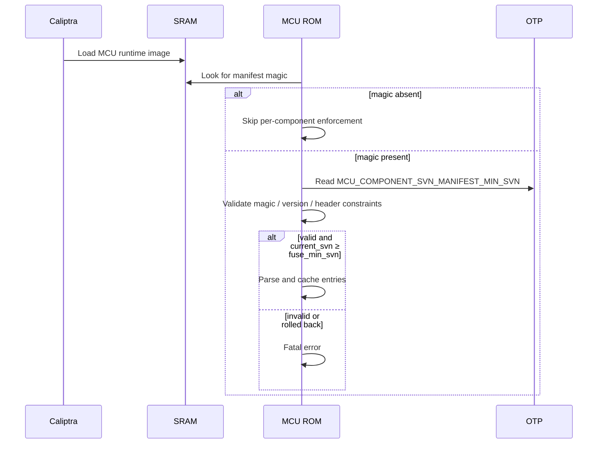

# Security Version Number (SVN) Anti-Rollback Specification

## Overview

Each firmware component tracks two SVN values:

- **`current_svn`** — the security version of the running image. Used for
  enforcement and attestation.
- **`min_svn`** — the minimum acceptable security version, stored in OTP fuses.
  Any image with `current_svn < min_svn` is rejected.

`min_svn` is set independently of `current_svn`. A release may carry
`current_svn = 10` but `min_svn = 7`, allowing rollback to versions 7–9 while
the device runs version 10. The deployer chooses when to permanently commit a
new minimum.

This document covers four categories of components:

1. **Caliptra Core firmware** — enforced by Caliptra Core ROM.
2. **MCU Runtime firmware** — its `current_svn` is the **SoC manifest SVN**
   (the same value Caliptra Core authenticates and binds into the MCU
   Runtime's DPE context). Enforcement and the fuse floor are owned by
   Caliptra Core (`CPTRA_CORE_SOC_MANIFEST_SVN`). MCU ROM, as the OTP
   writer for the subsystem, performs the actual OTP burn when the
   integrator provides the new floor; it does not maintain a separate
   MCU-side floor.
3. **MCU Component SVN Manifest** — its own SVN, enforced by MCU ROM against
   `MCU_COMPONENT_SVN_MANIFEST_MIN_SVN`.
4. **SoC component images** — manifest-level SVN enforced by Caliptra Core;
   optional per-component enforcement by MCU against `SOC_IMAGE_MIN_SVN[i]`.

### MCU Runtime SVN reuses the SoC manifest SVN

The MCU Runtime image is delivered as part of the SoC manifest and is
authenticated by Caliptra Core, which then creates the MCU Runtime's DPE
context using the SoC manifest's SVN. To keep DPE attestation and
anti-rollback consistent, MCU Runtime does **not** declare its own SVN
independently of the SoC manifest: there is exactly one SVN per release
for MCU Runtime, and it lives in the SoC manifest.

The fuse-backed floor for this SVN is `CPTRA_CORE_SOC_MANIFEST_SVN`,
which Caliptra Core both enforces and owns the policy for. Caliptra
Core cannot burn its own fuses, so MCU ROM owns the OTP write. The new
floor is declared in the authenticated MCU runtime SVN header
(`soc_manifest_min_svn`) and burned by MCU ROM (see
[Caliptra runtime and SoC manifest SVN floors](#caliptra-runtime-and-soc-manifest-svn-floors)).
There is no separate MCU-side floor or MCU-side enforcement for the MCU
Runtime SVN.

## Threat Model

SVN anti-rollback prevents an attacker who controls the firmware delivery path
(flash, recovery interface, network boot server) from downgrading firmware to
a signed-but-older version with known vulnerabilities. Enforcement relies on
OTP fuses as a tamper-resistant monotonic store, signed images that declare an
SVN, and ROM code that compares the two before execution.

## SVN Fuses

### Caliptra Core SVN Fuses (existing)

These fuses live in the `SVN_PARTITION` (partition 8) and are owned by Caliptra
Core. MCU ROM reads them from OTP and writes them to Caliptra's fuse registers
during cold boot; Caliptra Core enforces anti-rollback internally.

| Fuse | Size | Purpose |
|---|---|---|
| `CPTRA_CORE_FMC_KEY_MANIFEST_SVN` | 4 B | FMC key manifest (currently unused — see note below) |
| `CPTRA_CORE_RUNTIME_SVN` | 16 B | Caliptra Runtime firmware |
| `CPTRA_CORE_SOC_MANIFEST_SVN` | 16 B | SoC manifest |
| `CPTRA_CORE_SOC_MANIFEST_MAX_SVN` | 4 B | Maximum allowed SoC manifest SVN |

> **Note:** `CPTRA_CORE_FMC_KEY_MANIFEST_SVN` is reserved in the OTP map. MCU
> ROM forwards it to Caliptra's `FUSE_FMC_KEY_MANIFEST_SVN` register (alongside
> the other SVN fuses), but neither MCU nor Caliptra Core currently consumes
> the value for any check. It is documented here for completeness;
> integrators do not need to provision it for current behavior.

The pre-existing `CPTRA_CORE_ANTI_ROLLBACK_DISABLE` fuse (in
`sw_manuf_partition`) controls enforcement for both Caliptra Core and MCU. When
set, neither side rejects lower-SVN images and no SVN fuses are burned. MCU
reuses this fuse rather than introducing a separate MCU-only switch. The fuse
defaults to 0 (enforcement on) and should be set only on development or
manufacturing devices.

### New MCU SVN Fuses

Added in a vendor partition (e.g., `VENDOR_NON_SECRET_PROD_PARTITION`):

| Fuse | Size | Recommended Encoding | Purpose |
|---|---|---|---|
| `MCU_COMPONENT_SVN_MANIFEST_MIN_SVN` | 4 B | `OneHotLinearOr{bits:N, dupe:3}` | Min SVN for the MCU Component SVN Manifest itself |
| `SOC_IMAGE_MIN_SVN[0..M]` | 4 B each | `OneHotLinearOr{bits:N, dupe:3}` | Per-slot SoC image min SVN (optional) |

The number of `SOC_IMAGE_MIN_SVN` slots (`M`) and the number of bit-count bits
per slot are integrator-defined. `MCU_COMPONENT_SVN_MANIFEST_MIN_SVN` exists
even when the integrator does not provision any `SOC_IMAGE_MIN_SVN` slots,
because the manifest's own anti-rollback applies regardless of how many
component slots are mapped.

#### Encoding

SVN fuses **must** use a monotonic bit-count encoding so that incrementing
requires only burning an additional bit (any other encoding would either need
1→0 transitions or provide no rollback protection). In the current MCU fuse
layout names this is called `OneHot`, but it is not true one-hot encoding; it is
decoded by counting set bits. The recommended layout is `OneHotLinearOr` with
3× duplication: OR semantics tolerate single-bit read errors without ECC, which
is incompatible with fields written more than once. OR is preferred over
majority vote because OTP bits are far more likely to fail stuck-at-0 than to
spontaneously flip to 1.

Integrators with hardware-level fuse redundancy can use a plain `OneHot{bits:N}`
layout as currently named by MCU software. Other bit-count variants (e.g.,
`OneHotLinearMajorityVote`) are also acceptable when their fault model is
appropriate. Literal encodings such as `Single` cannot be used.

See [Fuse Layout Options](fuses.md#fuse-layout-options) for encoding details.

## MCU Component SVN Manifest (Optional)

For per-component SoC image anti-rollback, the MCU runtime image may
include an **MCU Component SVN Manifest** mapping each SoC `component_id`
to a `(current_svn, min_svn)` pair. The manifest is a header in the MCU
runtime image — similar in shape to the
[firmware-manifest DOT section](./firmware_format.md#firmware-manifest-dot-section)
— identified by its magic. MCU ROM looks for the magic in MCU SRAM after
Caliptra Core has loaded the runtime; if absent, no per-component
enforcement is performed and the `SOC_IMAGE_MIN_SVN` fuses are unused.
Each `component_id` is mapped to a specific `SOC_IMAGE_MIN_SVN[i]` fuse
slot via the platform's SVN Fuse Map (see
[Component SVN Fuse Map](#component-svn-fuse-map)).

### Format

The header is a fixed-size structure.

| Field | Size | Description |
|---|---|---|
| Magic | 4 B | `0x4D435356` (`"MCSV"`) |
| Format Version | 2 B | Header format version (currently 1) |
| `current_svn` | 1 B | SVN of this header (rolled forward when header contents change) |
| `min_svn` | 1 B | Requested new floor to burn into `MCU_COMPONENT_SVN_MANIFEST_MIN_SVN` (0 = no update) |
| `caliptra_runtime_min_svn` | 1 B | Requested new floor to burn into `CPTRA_CORE_RUNTIME_SVN` (0 = no update) |
| `soc_manifest_min_svn` | 1 B | Requested new floor to burn into `CPTRA_CORE_SOC_MANIFEST_SVN` — the shared SoC manifest / MCU Runtime SVN floor (0 = no update) |
| Reserved | 6 B | Pads the header to 16 bytes; ignored on parse |
| Entries | 8 B × 126 | `(component_id: u32, current_svn: u16, min_svn: u16)` |

Total: 1024 bytes (16-byte header + 1008 bytes of entries). The entry
count is one fewer than Caliptra's `AUTH_MANIFEST_IMAGE_METADATA_MAX_COUNT`
(127); the slot is yielded to the fixed header so the structure stays a
round 1024 bytes. The Caliptra runtime and SoC manifest SVNs max out at
128, so `caliptra_runtime_min_svn` and `soc_manifest_min_svn` are single
bytes; the per-component SoC image SVNs (in the entries) use `u16` since
they may be larger.

An entry where all fields are zero (`component_id == current_svn == min_svn == 0`)
is treated as an empty slot and ignored, allowing headers to declare fewer
than 126 entries by zero-padding.

The header is implemented in `caliptra-mcu-romtime` so it can be parsed
both by MCU ROM (the OTP writer) and by later stages such as the early
runtime image or an FMC.

Header constraints (validated; header is rejected on violation):

- `min_svn ≤ current_svn` (manifest-self).
- Each requested floor (`min_svn`, `caliptra_runtime_min_svn`,
  `soc_manifest_min_svn`) must fit within its target fuse's bit-count range
  (`MCU_COMPONENT_SVN_MANIFEST_MIN_SVN`, `CPTRA_CORE_RUNTIME_SVN`,
  `CPTRA_CORE_SOC_MANIFEST_SVN` respectively).

Per-entry constraints (validated; entry is rejected on violation):

- `min_svn ≤ current_svn`
- Both values must fit within the corresponding fuse slot's bit-count range.

### Caliptra runtime and SoC manifest SVN floors

`FW_INFO` reports the **running** Caliptra runtime SVN (`fw_svn`) but
not a new floor, and never exposes the SoC manifest SVN at all. So the
authenticated header carries the requested new floors directly. The
header does **not** carry a separate "current" SVN for these — the
running value is taken from `FW_INFO` where available:

- **Caliptra runtime** — MCU ROM reads `FW_INFO.fw_svn` and requires
  `fw_svn ≥ caliptra_runtime_min_svn` (so the floor never exceeds the
  running firmware's SVN), then burns `caliptra_runtime_min_svn` into
  `CPTRA_CORE_RUNTIME_SVN`. A floor above `fw_svn` is a fatal error.
- **SoC manifest / MCU Runtime** — these share one SVN and one fuse
  floor (`CPTRA_CORE_SOC_MANIFEST_SVN`); the MCU Runtime image is
  delivered in the SoC manifest and authenticated with its SVN.
  `FW_INFO` exposes neither, so `soc_manifest_min_svn` is burned into
  `CPTRA_CORE_SOC_MANIFEST_SVN` on trust. The header is authenticated as
  part of the MCU runtime image, so the integrator is responsible for
  not requesting a floor the running SoC manifest / MCU Runtime can't
  satisfy.

Both burns only occur when anti-rollback is enabled and the requested
floor strictly exceeds the current fuse value.

### `component_id` and Fuse Mapping

`component_id` is the same 32-bit identifier Caliptra uses in
`AuthManifestImageMetadata.component_id`. No new identifier scheme is
introduced.

Mapping `component_id → SOC_IMAGE_MIN_SVN[i]` is done by the platform-defined
`SVN_FUSE_MAP`, a static table compiled into ROM and runtime. The integrator
keeps three things in sync: `component_id` in the SoC manifest, `component_id`
in the MCU Component SVN Manifest, and `component_id → fuse slot` in
`SVN_FUSE_MAP`.

If a manifest entry's `component_id` is not in `SVN_FUSE_MAP`, per-component
enforcement is skipped for that component (with a logged warning) — this allows
new components without dedicated fuse slots to ship without breaking boot.

The map is **many-to-one**: multiple `component_id` values may share the same
`SOC_IMAGE_MIN_SVN[i]` slot, in which case those components share a `min_svn`
floor. This is appropriate for components that always update together as a
unit and conserves fuse space. Sharing components must agree on `min_svn` per
release; the build system should validate this.

### Loading and Authentication

The manifest is a header in the MCU runtime image, so it is authenticated
together with the runtime by Caliptra Core's signature check on the SoC
manifest.

After Caliptra Core loads MCU Runtime into SRAM, MCU ROM looks for the
manifest's magic at the manifest's location in SRAM. If the magic is
absent, no manifest processing is performed and per-component enforcement
is skipped. If the magic is present, MCU ROM validates the header before
any per-component enforcement or fuse burning:

1. Verify Magic and Format Version.
2. Validate the header constraints (see [Format](#format)).
3. Read `MCU_COMPONENT_SVN_MANIFEST_MIN_SVN` and
   `CPTRA_CORE_ANTI_ROLLBACK_DISABLE` from OTP.
4. If anti-rollback is not disabled and `header.current_svn < fuse_min_svn`:
   reject the runtime image.
5. Parse and cache entries.

Burning the requested `MCU_COMPONENT_SVN_MANIFEST_MIN_SVN` floor happens
later, in ROM, via the same triggering mechanism as the other `min_svn`
burns (see [SVN Fuse Burning](#svn-fuse-burning)).



## Enforcement Flows

### Cold Boot — Caliptra Core SVNs

MCU ROM reads the Caliptra Core SVN fuses from OTP and writes them to
Caliptra's fuse registers (`CPTRA_CORE_FMC_KEY_MANIFEST_SVN` is forwarded but
unused; see the note above). Caliptra Core ROM authenticates its firmware
and compares image SVN against fuse SVN, rejecting on mismatch.

Caliptra Core cannot burn its own fuses; MCU ROM is the OTP writer for
the subsystem. The new floors for `CPTRA_CORE_RUNTIME_SVN` and
`CPTRA_CORE_SOC_MANIFEST_SVN` come from the authenticated MCU runtime
SVN header (see
[Caliptra runtime and SoC manifest SVN floors](#caliptra-runtime-and-soc-manifest-svn-floors)),
not from `FW_INFO` — `FW_INFO` reports only the *running* SVNs, which
cannot express a new minimum. After the runtime image is in SRAM and
decrypted, MCU ROM processes the SVN header (in `FwBoot`), reads
`FW_INFO` to corroborate the Caliptra runtime SVN, and burns the
requested floors when anti-rollback is enabled and each floor strictly
exceeds the current fuse value. The burned floors take effect on the
next cold boot; this boot continues with the already-loaded fuse values
Caliptra Core consulted at authentication time.

### Hitless Update — Caliptra Core SVNs

When the bundle is delivered via a hitless update, Caliptra Core and
MCU reset together. Caliptra Core takes its **update reset** path, then
MCU ROM enters `FwHitlessUpdate`, waits for `soc.fw_ready()`, and runs
the same SVN-header processing as the cold-boot path (the header has
been re-loaded with the new runtime image, so its
`caliptra_runtime_min_svn` / `soc_manifest_min_svn` reflect the new
bundle).

The header-driven model is what makes hitless rollback protection work:
Caliptra's `update_reset` deliberately clamps its *internal* floor
(`fw_min_svn = min(old, new_fw_svn)`) to preserve rollback, so it never
asks for a higher floor on its own. The new floor must instead be
declared by the (authenticated) header. MCU ROM still requires
`caliptra_runtime_min_svn ≤ FW_INFO.fw_svn` so a header can't raise the
floor above what the running firmware actually satisfies.

Note: Caliptra fuse registers are latched at cold-boot fuse-write time
and cannot be re-written during a warm/update reset. Any OTP burn that
MCU ROM performs after a hitless update therefore only gates Caliptra
authentication on the *next* cold boot — power-fail safe via the OTP
bit-count encoding.

### Cold Boot and Hitless Update — MCU Component SVN Manifest burn

When the manifest is present and has been validated, MCU ROM burns
`MCU_COMPONENT_SVN_MANIFEST_MIN_SVN` from the manifest header. If
anti-rollback is not disabled and `manifest_header.min_svn > fuse_min_svn`:
burn the fuse and read back to verify.

### Cold Boot and Hitless Update — SoC Component min_svn Burn

When the manifest is present, MCU ROM walks each non-empty entry and,
for those whose `component_id` is in `SVN_FUSE_MAP`, advances the mapped
`SOC_IMAGE_MIN_SVN[i]` slot:

1. Look up `component_id` in `SVN_FUSE_MAP`. If absent, skip the entry
   with a logged warning (lets new components ship without a dedicated
   fuse slot).
2. Reject the boot if `entry.current_svn` or `entry.min_svn` exceeds the
   slot's bit-count range, or if `entry.current_svn < fuse_min_svn`
   (rollback).
3. If `entry.min_svn > fuse_min_svn` and anti-rollback is not disabled,
   burn the slot to `entry.min_svn` and read back to verify.

The map is many-to-one: several `component_id`s may target the same
slot, in which case the highest requested floor wins.

### PLDM Firmware Update — SVN Verification

When firmware is delivered via PLDM (covering both initial provisioning and
hitless updates that drive the Activate-then-reset flow), MCU Runtime performs
SVN checks during the **Verify Component** phase of the PLDM update flow,
alongside the existing digest checks (see
[Firmware Update](firmware_update.md)). Failing the SVN check at this stage
rejects the bundle before it can be applied or activated, so a downgrade
attempt never makes it to the hitless reset.

For each component in the bundle:

1. **MCU Runtime image** — obtain the bundle's SoC manifest SVN
   (`soc_manifest_svn`) from the new SoC manifest. Reject if
   `soc_manifest_svn < fuse_min_svn (CPTRA_CORE_SOC_MANIFEST_SVN)`. The
   floor itself is owned by Caliptra Core; MCU Runtime only consults it
   here as a fast-fail before the bundle is handed to Caliptra Core for
   authentication.
2. **MCU Component SVN Manifest** — if the new MCU runtime image contains
   the manifest header (identified by magic), validate Magic / Format
   Version and the header constraints (see [Format](#format)). Reject if
   `manifest.current_svn < fuse_min_svn
   (MCU_COMPONENT_SVN_MANIFEST_MIN_SVN)` or if any per-entry constraint
   is violated. If no manifest header is present, skip per-component SVN
   verification for this bundle.
3. **SoC component images** — for each component whose `component_id` is in
   both the MCU Component SVN Manifest and `SVN_FUSE_MAP`:
   - Use the platform's `SocComponentSvn` trait (below) to extract the SVN
     directly from the component bytes.
   - Verify the trait-extracted SVN matches the MCU Component SVN Manifest's
     `current_svn` for that component. A mismatch means the manifest and
     image disagree — reject the bundle.
    - Reject if `current_svn < fuse_min_svn`, or if either `current_svn` or
       `min_svn` exceeds the slot's bit-count range.

Components without a `SocComponentSvn` implementation skip the
manifest-vs-image cross-check (a logged warning) but still get the
`current_svn < fuse_min_svn` check using the manifest's value. This allows
opaque or pre-existing component formats to participate in fuse-level
rollback protection without forcing the integrator to parse them.

After PLDM verification succeeds, the bundle is applied and activated. The
hitless update reset then triggers MCU ROM, which performs the actual
fuse burns described in
[Cold Boot — Caliptra Core SVNs](#cold-boot--caliptra-core-svns)
and
[Cold Boot and Hitless Update — SoC Component min_svn Burn](#cold-boot-and-hitless-update--soc-component-min_svn-burn).

#### `SocComponentSvn` Trait

Integrators provide an implementation per SoC component type so the SDK can
extract the running SVN from the component's binary without knowing the
internal format:

```rust
pub trait SocComponentSvn {
    /// Extract the current SVN encoded in this component's image bytes.
    /// Returns `None` if the component has no embedded SVN (in which case
    /// the manifest cross-check is skipped for this component).
    fn current_svn(&self, image: &[u8]) -> Option<u16>;
}
```

The platform registers a `SocComponentSvn` per `component_id` (typically in
the same place as `SVN_FUSE_MAP`).

### Runtime — SoC Image SVN Enforcement on Loading (Optional)

When MCU Runtime loads SoC images at boot (after a cold boot or after the
hitless update reset has placed new images in their flash partitions), it
enforces per-component SVN before each image is loaded to its target. For
each image whose `component_id` is in both the MCU Component SVN Manifest and
`SVN_FUSE_MAP`:

1. Read `current_svn` from the manifest (and optionally cross-check against
   the trait, as in PLDM verify).
2. Read the corresponding `SOC_IMAGE_MIN_SVN[i]` fuse.
3. If `current_svn < fuse_min_svn`: reject the image.

If the manifest is absent, per-component enforcement is skipped; only the
Caliptra-enforced SoC manifest SVN applies.

## SVN Fuse Burning

`min_svn` fuses are **only burned by MCU ROM**. Runtime never burns SVN fuses,
ensuring fuse programming runs in the most trusted execution context before
mutable firmware has control. This applies to both MCU-owned fuses
(`MCU_COMPONENT_SVN_MANIFEST_MIN_SVN`, `SOC_IMAGE_MIN_SVN[*]`) and
Caliptra-owned fuses like `CPTRA_CORE_SOC_MANIFEST_SVN` —
all OTP writes in the subsystem go through MCU.

Burns are triggered exclusively by authenticated firmware images. The
MCU runtime SVN header carries every requested floor: `min_svn` for the
manifest-self burn, `caliptra_runtime_min_svn` for `CPTRA_CORE_RUNTIME_SVN`,
`soc_manifest_min_svn` for `CPTRA_CORE_SOC_MANIFEST_SVN`, and per-entry
`min_svn` fields for SoC component slots. ROM only burns when the
requested floor strictly exceeds the current fuse value.

The Caliptra runtime floor gets an extra guard: MCU ROM reads `FW_INFO`
and requires `caliptra_runtime_min_svn ≤ FW_INFO.fw_svn` before burning
`CPTRA_CORE_RUNTIME_SVN`. The SoC manifest SVN is not exposed by
`FW_INFO`, so `soc_manifest_min_svn` is burned on trust from the
authenticated header. A deployer can also advance the Caliptra runtime
floor independently of any header via the runtime
`FuseIncreaseCaliptraMinSvn` mailbox command.

**Validate before burn.** Because OTP burns are irreversible, MCU ROM
runs *all* fatal-able checks across every floor (manifest-self,
per-component, and the Caliptra-runtime `FW_INFO` cross-check) before
committing *any* burn. This guarantees a rejected boot never leaves the
device with partially-advanced floors; once the burn phase starts, only
a genuine OTP write/readback hardware error can halt it.

The burn is power-fail safe: bit-count encoding plus OR semantics mean a partial
burn can never decrease the fuse value, and any incomplete burn will be
re-attempted (and complete) on the next boot.

| Component | Burned by | Source of `min_svn` | Trigger |
|---|---|---|---|
| Caliptra Core RT | MCU ROM | header `caliptra_runtime_min_svn` | cold boot and hitless update |
| Caliptra Core RT | MCU Runtime → OTP syscall | running `FW_INFO.fw_svn` | `FuseIncreaseCaliptraMinSvn` mailbox command (deployer-driven) |
| SoC manifest / MCU Runtime | MCU ROM | header `soc_manifest_min_svn` | cold boot and hitless update |
| MCU Component SVN Manifest | MCU ROM | header `min_svn` | cold boot and hitless update |
| SoC images (optional) | MCU ROM | MCU Component SVN Manifest entry | cold boot and hitless update |

## Platform Configuration

### Fuse Definition

In `vendor_fuses.hjson`:

```js
{
  non_secret_vendor: [
    {"mcu_component_svn_manifest_min_svn": 4},
    {"soc_image_min_svn_0": 4},
    {"soc_image_min_svn_1": 4},
    // ... additional slots as needed
  ],
  fields: [
    {name: "mcu_component_svn_manifest_min_svn", bits: 8},
    {name: "soc_image_min_svn_0", bits: 8},
    {name: "soc_image_min_svn_1", bits: 8},
  ]
}
```

`CPTRA_CORE_ANTI_ROLLBACK_DISABLE` and `CPTRA_CORE_SOC_MANIFEST_SVN` are
part of the standard Caliptra fuse map and do not need to be redeclared.

### Component SVN Fuse Map

Compiled into ROM and MCU Runtime:

```rust
pub struct SvnFuseMapEntry {
    pub component_id: u32,
    pub fuse_entry: &'static FuseEntryInfo,
}

pub static SVN_FUSE_MAP: &[SvnFuseMapEntry] = &[
    SvnFuseMapEntry { component_id: 0x0000_1000, fuse_entry: &OTP_SOC_IMAGE_MIN_SVN_0 },
    SvnFuseMapEntry { component_id: 0x0000_1001, fuse_entry: &OTP_SOC_IMAGE_MIN_SVN_0 }, // shares slot 0
    SvnFuseMapEntry { component_id: 0x0000_1002, fuse_entry: &OTP_SOC_IMAGE_MIN_SVN_1 },
];
```

The MCU Runtime / SoC manifest SVN is not part of `SVN_FUSE_MAP`: its
floor lives in `CPTRA_CORE_SOC_MANIFEST_SVN` and is owned by Caliptra
Core.

## Security Considerations

**`min_svn` vs `current_svn` separation.** Storing only `min_svn` in fuses
gives deployers control over when to permanently commit a new floor and avoids
leaking the running version through OTP state. A release can carry a high
`current_svn` while keeping `min_svn` lower for staged rollout.

**Single SVN per release for MCU Runtime.** MCU Runtime's `current_svn` is
the SoC manifest SVN. Caliptra Core uses this value for the MCU Runtime
DPE context and enforces it against `CPTRA_CORE_SOC_MANIFEST_SVN`. There
is no separate MCU-side floor: MCU ROM only acts as the OTP writer for
the Caliptra-owned floor, so the value bound into DPE, the value
enforced against the fuse, and the value physically burned are all the
same single attested SVN — there is no way for the manifest signer to
declare a different version to MCU than the one bound into DPE.

**Manifest-format SVN is separate from component SVNs.** The MCU Component
SVN Manifest carries its own `current_svn`/`min_svn` (enforced against
`MCU_COMPONENT_SVN_MANIFEST_MIN_SVN`) so that the manifest format itself can
be rollback-protected independently of the SoC components it describes.
A new manifest that drops or weakens enforcement for a previously fuse-locked
component cannot be installed without advancing the manifest-self SVN.

**ROM-only fuse burning.** All `min_svn` burns occur in ROM, before mutable
firmware runs. Runtime cannot be exploited to advance `min_svn` to
attacker-chosen values; the only inputs to ROM are signed images and signed
manifests.

**One-way commitment.** OTP can only burn 0→1, so `min_svn` only increases. A
release that mistakenly raises `min_svn` cannot be undone — recovery requires a
new release with `current_svn ≥` the committed value.

**Anti-rollback disable polarity.** `CPTRA_CORE_ANTI_ROLLBACK_DISABLE` uses
disable polarity (burning removes a security property) for compatibility with
the existing Caliptra fuse. Provisioning flows must never set this fuse on
production devices; ROM should add lifecycle-state checks to enforce this.

**SVN exhaustion.** With bit-count encoding, the maximum `min_svn` equals the
number of allocated bits (e.g., 32 bits → max SVN of 32). Since `current_svn`
can advance without `min_svn`, exhaustion is rare in practice. At exhaustion,
no further `min_svn` updates are possible but the device continues to enforce
the maximum value.

**Device Ownership Transfer.** SVN fuses are orthogonal to ownership. DOT does
not reset `min_svn`. A new owner inherits the existing `min_svn` state.
