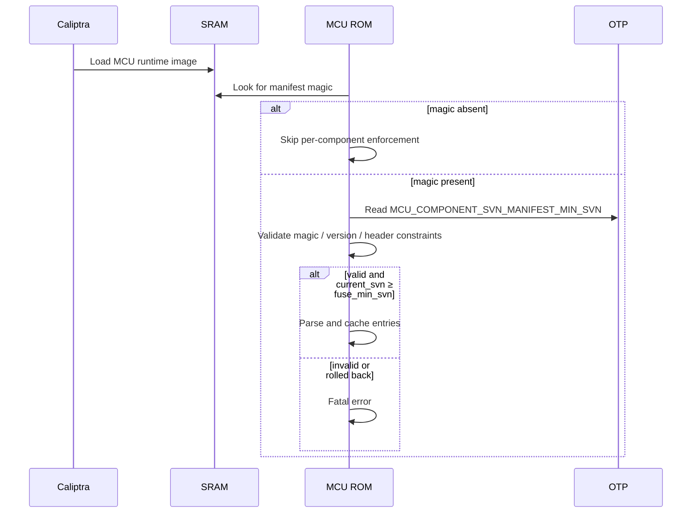
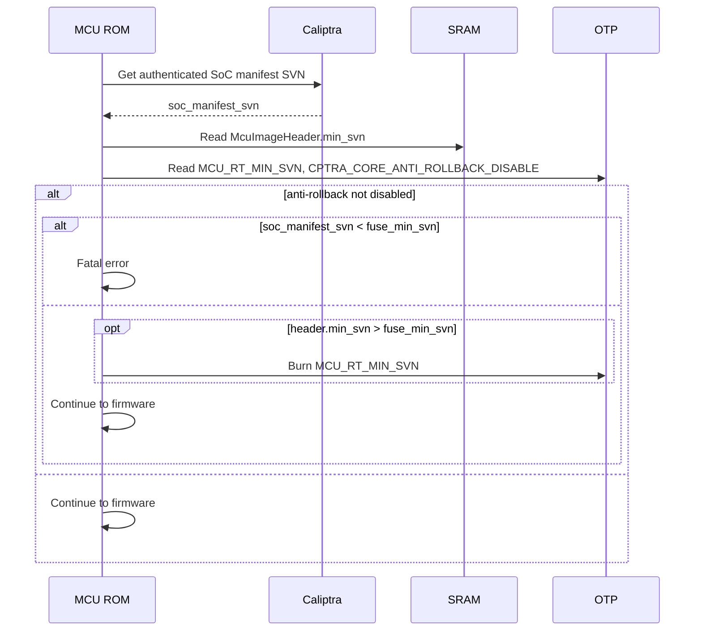

# Security Version Number (SVN) Anti-Rollback Specification

## Overview

Each firmware component tracks two SVN values:

- **`current_svn`** — the security version of the running image. Used for
  enforcement and attestation.
- **`min_svn`** — the minimum acceptable security version, stored in OTP fuses.
  Any image with `current_svn < min_svn` is rejected.

`min_svn` is set independently of `current_svn`. A release may carry
`current_svn = 10` but `min_svn = 7`, allowing rollback to versions 7–9 while
the device runs version 10. The deployer chooses when to permanently commit a
new minimum.

This document covers four categories of components:

1. **Caliptra Core firmware** — enforced by Caliptra Core ROM.
2. **MCU Runtime firmware** — its `current_svn` is the **SoC manifest SVN**
   (the same value Caliptra Core authenticates and binds into the MCU
   Runtime's DPE context). Enforced by both Caliptra Core (against
   `CPTRA_CORE_SOC_MANIFEST_SVN`) and, with a separate vendor-controlled
   floor, by MCU ROM (against `MCU_RT_MIN_SVN`).
3. **MCU Component SVN Manifest** — its own SVN, enforced by MCU ROM against
   `MCU_COMPONENT_SVN_MANIFEST_MIN_SVN`.
4. **SoC component images** — manifest-level SVN enforced by Caliptra Core;
   optional per-component enforcement by MCU against `SOC_IMAGE_MIN_SVN[i]`.

### MCU Runtime SVN reuses the SoC manifest SVN

The MCU Runtime image is delivered as part of the SoC manifest and is
authenticated by Caliptra Core, which then creates the MCU Runtime's DPE
context using the SoC manifest's SVN. To keep DPE attestation, Caliptra
Core's anti-rollback, and MCU's anti-rollback consistent, MCU Runtime does
**not** declare its own `current_svn` independently of the SoC manifest:
there is exactly one SVN per release for MCU Runtime, and it lives in the
SoC manifest. MCU ROM obtains the authenticated SoC manifest SVN from
Caliptra Core (mechanism is platform-defined; see
[Cold Boot and Hitless Update — MCU Runtime SVN](#cold-boot-and-hitless-update--mcu-runtime-svn)).

`MCU_RT_MIN_SVN` is a separate, MCU-vendor-controlled floor the MCU ROM
enforces against this same SoC manifest SVN. It is independent of
`CPTRA_CORE_SOC_MANIFEST_SVN` so that an MCU vendor (or device owner)
can advance the floor without coordinating a Caliptra Core fuse change,
and so that ownership-transfer operations that retarget Caliptra fuses do
not silently disturb the MCU-side floor.

## Threat Model

SVN anti-rollback prevents an attacker who controls the firmware delivery path
(flash, recovery interface, network boot server) from downgrading firmware to
a signed-but-older version with known vulnerabilities. Enforcement relies on
OTP fuses as a tamper-resistant monotonic store, signed images that declare an
SVN, and ROM code that compares the two before execution.

## SVN Fuses

### Caliptra Core SVN Fuses (existing)

These fuses live in the `SVN_PARTITION` (partition 8) and are owned by Caliptra
Core. MCU ROM reads them from OTP and writes them to Caliptra's fuse registers
during cold boot; Caliptra Core enforces anti-rollback internally.

| Fuse | Size | Purpose |
|---|---|---|
| `CPTRA_CORE_FMC_KEY_MANIFEST_SVN` | 4 B | FMC key manifest (currently unused — see note below) |
| `CPTRA_CORE_RUNTIME_SVN` | 16 B | Caliptra Runtime firmware |
| `CPTRA_CORE_SOC_MANIFEST_SVN` | 16 B | SoC manifest |
| `CPTRA_CORE_SOC_MANIFEST_MAX_SVN` | 4 B | Maximum allowed SoC manifest SVN |

> **Note:** `CPTRA_CORE_FMC_KEY_MANIFEST_SVN` is reserved in the OTP map. MCU
> ROM forwards it to Caliptra's `FUSE_FMC_KEY_MANIFEST_SVN` register (alongside
> the other SVN fuses), but neither MCU nor Caliptra Core currently consumes
> the value for any check. It is documented here for completeness;
> integrators do not need to provision it for current behavior.

The pre-existing `CPTRA_CORE_ANTI_ROLLBACK_DISABLE` fuse (in
`sw_manuf_partition`) controls enforcement for both Caliptra Core and MCU. When
set, neither side rejects lower-SVN images and no SVN fuses are burned. MCU
reuses this fuse rather than introducing a separate MCU-only switch. The fuse
defaults to 0 (enforcement on) and should be set only on development or
manufacturing devices.

### New MCU SVN Fuses

Added in a vendor partition (e.g., `VENDOR_NON_SECRET_PROD_PARTITION`):

| Fuse | Size | Recommended Encoding | Purpose |
|---|---|---|---|
| `MCU_RT_MIN_SVN` | 16 B | `OneHotLinearOr{bits:N, dupe:3}` | MCU Runtime min SVN (compared against the SoC manifest SVN) |
| `MCU_COMPONENT_SVN_MANIFEST_MIN_SVN` | 4 B | `OneHotLinearOr{bits:N, dupe:3}` | Min SVN for the MCU Component SVN Manifest itself |
| `SOC_IMAGE_MIN_SVN[0..M]` | 4 B each | `OneHotLinearOr{bits:N, dupe:3}` | Per-slot SoC image min SVN (optional) |

The number of `SOC_IMAGE_MIN_SVN` slots (`M`) and the number of one-hot bits
per slot are integrator-defined. `MCU_COMPONENT_SVN_MANIFEST_MIN_SVN` exists
even when the integrator does not provision any `SOC_IMAGE_MIN_SVN` slots,
because the manifest's own anti-rollback applies regardless of how many
component slots are mapped.

#### Encoding

SVN fuses **must** use a one-hot encoding so that incrementing requires only
burning an additional bit (any other encoding would either need 1→0 transitions
or provide no rollback protection). The recommended layout is `OneHotLinearOr`
with 3× duplication: OR semantics tolerate single-bit read errors without ECC,
which is incompatible with fields written more than once. OR is preferred over
majority vote because OTP bits are far more likely to fail stuck-at-0 than to
spontaneously flip to 1.

Integrators with hardware-level fuse redundancy can use a plain `OneHot{bits:N}`
layout. Other one-hot variants (e.g., `OneHotLinearMajorityVote`) are also
acceptable. Non-one-hot encodings (e.g., `Single`) cannot be used.

See [Fuse Layout Options](fuses.md#fuse-layout-options) for encoding details.

## MCU Image Header

The MCU Runtime binary may be preceded by an `McuImageHeader`. It carries
only the MCU-side `min_svn` burn request; the runtime's `current_svn` is
the SoC manifest SVN (see
[Overview](#mcu-runtime-svn-reuses-the-soc-manifest-svn)).

| Field | Size | Description |
|---|---|---|
| `min_svn` | 2 B | Requested new floor to burn into `MCU_RT_MIN_SVN` (0 = no update) |
| `reserved` | 6 B | Reserved (must be zero) |

Constraints (validated by ROM; image is rejected on violation):

- `min_svn ≤ soc_manifest_svn` (the authenticated SoC manifest SVN, obtained
  from Caliptra Core).
- `min_svn` must fit within the `MCU_RT_MIN_SVN` one-hot range.
- All `reserved` bytes must be zero.

The firmware bundler sets the requested floor via `--min-svn <min>`. There
is no `--svn` flag at MCU Runtime scope; the runtime's `current_svn` is the
SoC manifest's SVN, set by the SoC manifest signing flow.

## MCU Component SVN Manifest (Optional)

For per-component SoC image anti-rollback, the MCU runtime image may
include an **MCU Component SVN Manifest** mapping each SoC `component_id`
to a `(current_svn, min_svn)` pair. The manifest is a header in the MCU
runtime image — similar in shape to the
[firmware-manifest DOT section](./firmware_format.md#firmware-manifest-dot-section)
— identified by its magic. MCU ROM looks for the magic in MCU SRAM after
Caliptra Core has loaded the runtime; if absent, no per-component
enforcement is performed and the `SOC_IMAGE_MIN_SVN` fuses are unused.
Each `component_id` is mapped to a specific `SOC_IMAGE_MIN_SVN[i]` fuse
slot via the platform's SVN Fuse Map (see
[Component SVN Fuse Map](#component-svn-fuse-map)).

### Format

The manifest is a fixed-size structure. The per-entry section is sized to
match Caliptra's `AUTH_MANIFEST_IMAGE_METADATA_MAX_COUNT` (127 entries) —
the maximum number of components a single SoC manifest can describe.

| Field | Size | Description |
|---|---|---|
| Magic | 4 B | `0x4D435356` (`"MCSV"`) |
| Format Version | 2 B | Manifest format version |
| `current_svn` | 1 B | SVN of this manifest (rolled forward when manifest entries change) |
| `min_svn` | 1 B | Requested new floor to burn into `MCU_COMPONENT_SVN_MANIFEST_MIN_SVN` (0 = no update) |
| Entries | 8 B × 127 | `(component_id: u32, current_svn: u16, min_svn: u16)` |

Total: 1024 bytes (8-byte header + 1016 bytes of entries).

An entry where all fields are zero (`component_id == current_svn == min_svn == 0`)
is treated as an empty slot and ignored, allowing manifests to declare fewer
than 127 entries by zero-padding.

Header constraints (validated; manifest is rejected on violation):

- `min_svn ≤ current_svn`
- Both must fit within `MCU_COMPONENT_SVN_MANIFEST_MIN_SVN`'s one-hot range.

Per-entry constraints (validated; entry is rejected on violation):

- `min_svn ≤ current_svn`
- Both values must fit within the corresponding fuse slot's one-hot range.

### `component_id` and Fuse Mapping

`component_id` is the same 32-bit identifier Caliptra uses in
`AuthManifestImageMetadata.component_id`. No new identifier scheme is
introduced.

Mapping `component_id → SOC_IMAGE_MIN_SVN[i]` is done by the platform-defined
`SVN_FUSE_MAP`, a static table compiled into ROM and runtime. The integrator
keeps three things in sync: `component_id` in the SoC manifest, `component_id`
in the MCU Component SVN Manifest, and `component_id → fuse slot` in
`SVN_FUSE_MAP`.

If a manifest entry's `component_id` is not in `SVN_FUSE_MAP`, per-component
enforcement is skipped for that component (with a logged warning) — this allows
new components without dedicated fuse slots to ship without breaking boot.

The map is **many-to-one**: multiple `component_id` values may share the same
`SOC_IMAGE_MIN_SVN[i]` slot, in which case those components share a `min_svn`
floor. This is appropriate for components that always update together as a
unit and conserves fuse space. Sharing components must agree on `min_svn` per
release; the build system should validate this.

### Loading and Authentication

The manifest is a header in the MCU runtime image, so it is authenticated
together with the runtime by Caliptra Core's signature check on the SoC
manifest.

After Caliptra Core loads MCU Runtime into SRAM, MCU ROM looks for the
manifest's magic at the manifest's location in SRAM. If the magic is
absent, no manifest processing is performed and per-component enforcement
is skipped. If the magic is present, MCU ROM validates the header before
any per-component enforcement or fuse burning:

1. Verify Magic and Format Version.
2. Validate the header constraints (see [Format](#format)).
3. Read `MCU_COMPONENT_SVN_MANIFEST_MIN_SVN` and
   `CPTRA_CORE_ANTI_ROLLBACK_DISABLE` from OTP.
4. If anti-rollback is not disabled and `header.current_svn < fuse_min_svn`:
   reject the runtime image.
5. Parse and cache entries.

Burning the requested `MCU_COMPONENT_SVN_MANIFEST_MIN_SVN` floor happens
later, in ROM, via the same triggering mechanism as the other `min_svn`
burns (see [SVN Fuse Burning](#svn-fuse-burning)).



## Enforcement Flows

### Cold Boot — Caliptra Core SVNs

MCU ROM reads the Caliptra Core SVN fuses from OTP and writes them to
Caliptra's fuse registers (`CPTRA_CORE_FMC_KEY_MANIFEST_SVN` is forwarded but
unused; see the note above). Caliptra Core ROM authenticates its firmware,
compares image SVN against fuse SVN, rejects on mismatch, and updates its own
SVN fuses if the image SVN is higher and `CPTRA_CORE_ANTI_ROLLBACK_DISABLE` is
not set. MCU ROM has no role beyond fuse transport.

### Cold Boot and Hitless Update — MCU Runtime SVN

After Caliptra loads MCU Runtime into MCU SRAM, MCU ROM enforces and
potentially burns the MCU SVN before jumping to firmware. The same logic
applies on cold boot and hitless update reset:

1. Obtain the authenticated SoC manifest SVN from Caliptra Core. The
   precise mechanism is platform-defined: a Caliptra mailbox command, a
   shared MCI/SoC register, or MCU ROM directly parsing the SoC manifest
   from a known location after Caliptra has authenticated it. Whichever
   path is used, the value **must** be the one Caliptra Core authenticated
   (and used for the MCU Runtime DPE context); MCU ROM must not declare
   an alternate `current_svn` for the runtime.
2. (Optional) Read `McuImageHeader` from SRAM to obtain `header.min_svn`.
3. Read `MCU_RT_MIN_SVN` and `CPTRA_CORE_ANTI_ROLLBACK_DISABLE` from OTP.
4. If anti-rollback is not disabled and `soc_manifest_svn < fuse_min_svn`:
   reject with `ROM_MCU_SVN_CHECK_FAILED`.
5. If anti-rollback is not disabled and `header.min_svn > fuse_min_svn`:
   burn `MCU_RT_MIN_SVN` to `header.min_svn`, then read back and verify.
6. Continue to firmware.



The Firmware Boot flow (entered after cold boot triggers a reset) does not
re-check SVN; SRAM contents are unchanged since the cold-boot check.

### Cold Boot and Hitless Update — MCU Component SVN Manifest burn

When the manifest is present and has been validated, MCU ROM burns
`MCU_COMPONENT_SVN_MANIFEST_MIN_SVN` from the manifest header. If
anti-rollback is not disabled and `manifest_header.min_svn > fuse_min_svn`:
burn the fuse and read back to verify.

### Cold Boot and Hitless Update — SoC Component min_svn Burn

When the manifest is present, for each entry with `min_svn > 0` MCU ROM
burns the corresponding `SOC_IMAGE_MIN_SVN[i]` slot:

1. Look up `component_id` in `SVN_FUSE_MAP` to find the fuse slot.
2. If `entry.min_svn > fuse_min_svn` and anti-rollback is not disabled:
   burn the fuse.

### PLDM Firmware Update — SVN Verification

When firmware is delivered via PLDM (covering both initial provisioning and
hitless updates that drive the Activate-then-reset flow), MCU Runtime performs
SVN checks during the **Verify Component** phase of the PLDM update flow,
alongside the existing digest checks (see
[Firmware Update](firmware_update.md)). Failing the SVN check at this stage
rejects the bundle before it can be applied or activated, so a downgrade
attempt never makes it to the hitless reset.

For each component in the bundle:

1. **MCU Runtime image** — read `McuImageHeader.min_svn` from the new
   image and obtain the bundle's SoC manifest SVN (`soc_manifest_svn`)
   from the new SoC manifest. Reject if `soc_manifest_svn < fuse_min_svn
   (MCU_RT_MIN_SVN)`, if `McuImageHeader.min_svn > soc_manifest_svn`, or
   if `McuImageHeader.min_svn` exceeds the `MCU_RT_MIN_SVN` one-hot range.
2. **MCU Component SVN Manifest** — if the new MCU runtime image contains
   the manifest header (identified by magic), validate Magic / Format
   Version and the header constraints (see [Format](#format)). Reject if
   `manifest.current_svn < fuse_min_svn
   (MCU_COMPONENT_SVN_MANIFEST_MIN_SVN)` or if any per-entry constraint
   is violated. If no manifest header is present, skip per-component SVN
   verification for this bundle.
3. **SoC component images** — for each component whose `component_id` is in
   both the MCU Component SVN Manifest and `SVN_FUSE_MAP`:
   - Use the platform's `SocComponentSvn` trait (below) to extract the SVN
     directly from the component bytes.
   - Verify the trait-extracted SVN matches the MCU Component SVN Manifest's
     `current_svn` for that component. A mismatch means the manifest and
     image disagree — reject the bundle.
   - Reject if `current_svn < fuse_min_svn`, or if either `current_svn` or
     `min_svn` exceeds the slot's one-hot range.

Components without a `SocComponentSvn` implementation skip the
manifest-vs-image cross-check (a logged warning) but still get the
`current_svn < fuse_min_svn` check using the manifest's value. This allows
opaque or pre-existing component formats to participate in fuse-level
rollback protection without forcing the integrator to parse them.

After PLDM verification succeeds, the bundle is applied and activated. The
hitless update reset then triggers MCU ROM, which performs the actual
fuse burns described in
[Cold Boot and Hitless Update — MCU Runtime SVN](#cold-boot-and-hitless-update--mcu-runtime-svn)
and
[Cold Boot and Hitless Update — SoC Component min_svn Burn](#cold-boot-and-hitless-update--soc-component-min_svn-burn).

#### `SocComponentSvn` Trait

Integrators provide an implementation per SoC component type so the SDK can
extract the running SVN from the component's binary without knowing the
internal format:

```rust
pub trait SocComponentSvn {
    /// Extract the current SVN encoded in this component's image bytes.
    /// Returns `None` if the component has no embedded SVN (in which case
    /// the manifest cross-check is skipped for this component).
    fn current_svn(&self, image: &[u8]) -> Option<u16>;
}
```

The platform registers a `SocComponentSvn` per `component_id` (typically in
the same place as `SVN_FUSE_MAP`).

### Runtime — SoC Image SVN Enforcement on Loading (Optional)

When MCU Runtime loads SoC images at boot (after a cold boot or after the
hitless update reset has placed new images in their flash partitions), it
enforces per-component SVN before each image is loaded to its target. For
each image whose `component_id` is in both the MCU Component SVN Manifest and
`SVN_FUSE_MAP`:

1. Read `current_svn` from the manifest (and optionally cross-check against
   the trait, as in PLDM verify).
2. Read the corresponding `SOC_IMAGE_MIN_SVN[i]` fuse.
3. If `current_svn < fuse_min_svn`: reject the image.

If the manifest is absent, per-component enforcement is skipped; only the
Caliptra-enforced SoC manifest SVN applies.

## SVN Fuse Burning

`min_svn` fuses are **only burned by MCU ROM**. Runtime never burns SVN fuses,
ensuring fuse programming runs in the most trusted execution context before
mutable firmware has control.

Burns are triggered exclusively by authenticated firmware images: the
`McuImageHeader.min_svn` field for MCU Runtime, the MCU Component SVN
Manifest header's `min_svn` for the manifest itself, and per-entry
`min_svn` fields for SoC components. ROM only burns when the requested
`min_svn` strictly exceeds the current fuse value.

The burn is power-fail safe: one-hot encoding plus OR semantics mean a partial
burn can never decrease the fuse value, and any incomplete burn will be
re-attempted (and complete) on the next boot.

| Component | Burned by | Source of `min_svn` |
|---|---|---|
| Caliptra Core FMC/RT | Caliptra Core ROM | Caliptra image SVN |
| MCU Runtime | MCU ROM | `McuImageHeader.min_svn` |
| MCU Component SVN Manifest | MCU ROM | manifest header's `min_svn` |
| SoC images (optional) | MCU ROM | MCU Component SVN Manifest entry |

## Platform Configuration

### Fuse Definition

In `vendor_fuses.hjson`:

```js
{
  non_secret_vendor: [
    {"mcu_rt_min_svn": 16},
    {"mcu_component_svn_manifest_min_svn": 4},
    {"soc_image_min_svn_0": 4},
    {"soc_image_min_svn_1": 4},
    // ... additional slots as needed
  ],
  fields: [
    {name: "mcu_rt_min_svn", bits: 32},
    {name: "mcu_component_svn_manifest_min_svn", bits: 8},
    {name: "soc_image_min_svn_0", bits: 8},
    {name: "soc_image_min_svn_1", bits: 8},
  ]
}
```

`CPTRA_CORE_ANTI_ROLLBACK_DISABLE` is part of the standard Caliptra fuse map
and does not need to be redeclared.

### Component SVN Fuse Map

Compiled into ROM and MCU Runtime:

```rust
pub struct SvnFuseMapEntry {
    pub component_id: u32,
    pub fuse_entry: &'static FuseEntryInfo,
}

pub static SVN_FUSE_MAP: &[SvnFuseMapEntry] = &[
    SvnFuseMapEntry { component_id: 0x0000_0002, fuse_entry: &OTP_MCU_RT_MIN_SVN },
    SvnFuseMapEntry { component_id: 0x0000_1000, fuse_entry: &OTP_SOC_IMAGE_MIN_SVN_0 },
    SvnFuseMapEntry { component_id: 0x0000_1001, fuse_entry: &OTP_SOC_IMAGE_MIN_SVN_0 }, // shares slot 0
    SvnFuseMapEntry { component_id: 0x0000_1002, fuse_entry: &OTP_SOC_IMAGE_MIN_SVN_1 },
];
```

### ImageVerifier

ROM uses an `ImageVerifier` implementation to enforce the MCU Runtime SVN
against the **SoC manifest SVN** (obtained from Caliptra), not against an
independent value declared by `McuImageHeader`:

```rust
impl ImageVerifier for McuImageVerifier {
    fn verify_header(&self, header: &[u8], otp: &Otp, soc_manifest_svn: u16) -> bool {
        let Ok((header, _)) = McuImageHeader::ref_from_prefix(header) else {
            return false;
        };
        if otp.read_anti_rollback_disable().unwrap_or(0) != 0 {
            return true;
        }
        if header.min_svn > soc_manifest_svn {
            return false; // header requested a floor higher than the running version
        }
        let Ok(fuse_min_svn) = otp.read_mcu_rt_min_svn() else {
            return false;
        };
        soc_manifest_svn >= fuse_min_svn
    }
}
```

Obtaining `soc_manifest_svn` is platform-defined (Caliptra mailbox command,
shared register, or parsing the SoC manifest at a known location after
Caliptra has authenticated it). The same value is what Caliptra Core uses
to derive the MCU Runtime's DPE context, which guarantees DPE attestation
and ROM enforcement agree on a single SVN per release.

## Security Considerations

**`min_svn` vs `current_svn` separation.** Storing only `min_svn` in fuses
gives deployers control over when to permanently commit a new floor and avoids
leaking the running version through OTP state. A release can carry a high
`current_svn` while keeping `min_svn` lower for staged rollout.

**Single SVN per release for MCU Runtime.** MCU Runtime's `current_svn` is
the SoC manifest SVN (never an independent value in `McuImageHeader`). This
ensures the value Caliptra Core uses for the MCU Runtime DPE context, the
value Caliptra Core enforces against `CPTRA_CORE_SOC_MANIFEST_SVN`, and the
value MCU ROM enforces against `MCU_RT_MIN_SVN` are all the same single
attested SVN — there is no way for the manifest signer to declare a
different version to MCU than the one bound into DPE.

**Manifest-format SVN is separate from component SVNs.** The MCU Component
SVN Manifest carries its own `current_svn`/`min_svn` (enforced against
`MCU_COMPONENT_SVN_MANIFEST_MIN_SVN`) so that the manifest format itself can
be rollback-protected independently of the SoC components it describes.
A new manifest that drops or weakens enforcement for a previously fuse-locked
component cannot be installed without advancing the manifest-self SVN.

**ROM-only fuse burning.** All `min_svn` burns occur in ROM, before mutable
firmware runs. Runtime cannot be exploited to advance `min_svn` to
attacker-chosen values; the only inputs to ROM are signed images and signed
manifests.

**One-way commitment.** OTP can only burn 0→1, so `min_svn` only increases. A
release that mistakenly raises `min_svn` cannot be undone — recovery requires a
new release with `current_svn ≥` the committed value.

**Anti-rollback disable polarity.** `CPTRA_CORE_ANTI_ROLLBACK_DISABLE` uses
disable polarity (burning removes a security property) for compatibility with
the existing Caliptra fuse. Provisioning flows must never set this fuse on
production devices; ROM should add lifecycle-state checks to enforce this.

**SVN exhaustion.** With one-hot encoding, the maximum `min_svn` equals the
number of allocated bits (e.g., 32 bits → max SVN of 32). Since `current_svn`
can advance without `min_svn`, exhaustion is rare in practice. At exhaustion,
no further `min_svn` updates are possible but the device continues to enforce
the maximum value.

**Device Ownership Transfer.** SVN fuses are orthogonal to ownership. DOT does
not reset `min_svn`. A new owner inherits the existing `min_svn` state.
