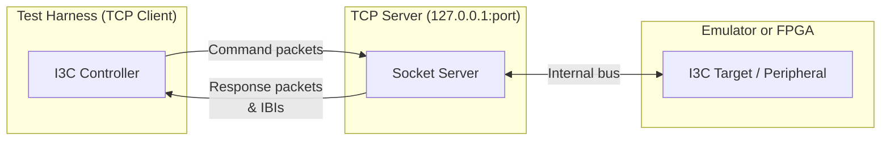

# I3C Testing over TCP

The Caliptra MCU software includes a TCP-based protocol for communicating with
the I3C bus during testing. A TCP server exposes the emulated (or FPGA) I3C bus
so that external test clients can send I3C commands and receive responses and
In-Band Interrupts (IBIs) over a plain TCP socket.

This protocol is used in both the software emulator and the FPGA hardware
model, making it the common interface for I3C integration testing regardless
of the underlying platform.

The software emulator or the FPGA will act as the **TCP server**, exposing
the emulator's I3C peripheral or the FPGA's real I3C implementation as an **I3C target**. The **TCP client** acts as the I3C controller and sends private writes
to the target inside the emulator or FPGA (and receives private reads after issuing them). IBIs are sent by the target inside emulator or FPGA to the TCP client.

## Overview

The server listens on `127.0.0.1:<port>` and accepts a single TCP connection at
a time. The protocol is a byte-oriented, binary framing over the TCP stream with
two packet types:

- **Command packets** — sent by the client (test harness) to the server.
  These represent I3C bus transactions directed at a target device.
- **Response packets** — sent by the server to the client. These carry
  either a response to a previous command or an unsolicited In-Band Interrupt
  (IBI) from a target device.

All multi-byte integers are **little-endian**.

## Command Packet (Client → Server)

A command packet consists of a 9-byte header followed by a variable-length
data payload.

| Offset | Size | Field |
|--------|------|-------|
| 0 | 1 | `to_addr` |
| 1 | 8 | `command_descriptor` |
| 9 | N | `data` (length determined by descriptor) |

| Field | Description |
|---|---|
| `to_addr` | The I3C dynamic address of the target device (1 byte). Valid range is `0x08`–`0x75`, excluding `0x3E` and `0x6E`. |
| `command_descriptor` | An 8-byte (64-bit) TCRI command descriptor. The lowest 3 bits (`cmd_attr`) select the command type. See [Command Types](#command-types). |
| `data` | Payload bytes. The length is determined by the `data_length` field in the descriptor. For Immediate commands, data is embedded in the descriptor and this field is absent (length 0). |

## Response Packet (Server → Client)

A response packet consists of a 6-byte header followed by a variable-length
data payload.

| Offset | Size | Field |
|--------|------|-------|
| 0 | 1 | `ibi` |
| 1 | 1 | `from_addr` |
| 2 | 4 | `response_descriptor` |
| 6 | N | `data` (length from descriptor) |

| Field | Description |
|---|---|
| `ibi` | If non-zero, this packet is an In-Band Interrupt notification. The value is the Mandatory Data Byte (MDB) for the IBI. If zero, this is a normal command response. |
| `from_addr` | The I3C dynamic address of the target device that produced this response or IBI. |
| `response_descriptor` | A 4-byte (32-bit) response descriptor. See [Response Descriptor](#response-descriptor). |
| `data` | Response payload bytes. Length is given by the `data_length` field in the response descriptor. |

## Command Types

The command descriptor is a 64-bit little-endian value. Bits `[2:0]` (`cmd_attr`)
determine the command type:

### Regular Transfer (`cmd_attr = 0`)

Used for variable-length private read/write transfers.

| Bits | Field | Description |
|------|-------|-------------|
| [2:0] | `cmd_attr` | = 0 |
| [6:3] | `tid` | Transaction ID |
| [14:7] | `cmd` | Command code |
| [15] | `cp` | Command present |
| [20:16] | `dev_index` | Device index |
| [24] | `short_read_err` | Short read error enable |
| [25] | `dbp` | Defining byte present |
| [28:26] | `mode` | Transfer mode |
| [29] | `rnw` | Direction: 0 = Write, 1 = Read |
| [30] | `wroc` | Write on completion |
| [31] | `toc` | Terminate on completion |
| [39:32] | `def_byte` | Defining byte |
| [63:48] | `data_length` | Number of data bytes to follow |

The `data_length` field specifies how many bytes follow the 9-byte header.
Set `rnw = 0` for a private write (client sends data) or `rnw = 1` for a
private read (requesting data from the target; `data_length` is 0 in the
command, and data arrives in the response).

### Immediate Transfer (`cmd_attr = 1`)

Embeds up to 4 bytes of data directly in the descriptor. No additional data
bytes follow the header.

| Bits | Field | Description |
|------|-------|-------------|
| [2:0] | `cmd_attr` | = 1 |
| [6:3] | `tid` | Transaction ID |
| [14:7] | `cmd` | Command code |
| [15] | `cp` | Command present |
| [20:16] | `dev_index` | Device index |
| [25:23] | `ddt` | Data descriptor type |
| [28:26] | `mode` | Transfer mode |
| [29] | `rnw` | Direction: 0 = Write, 1 = Read |
| [30] | `wroc` | Write on completion |
| [31] | `toc` | Terminate on completion |
| [39:32] | `data_byte_1` | Immediate data byte 1 |
| [47:40] | `data_byte_2` | Immediate data byte 2 |
| [55:48] | `data_byte_3` | Immediate data byte 3 |
| [63:56] | `data_byte_4` | Immediate data byte 4 |

### Combo Transfer (`cmd_attr = 3`)

A transfer with an embedded sub-offset, typically used for addressed reads.

| Bits | Field | Description |
|------|-------|-------------|
| [2:0] | `cmd_attr` | = 3 |
| [6:3] | `tid` | Transaction ID |
| [14:7] | `cmd` | Command code |
| [15] | `cp` | Command present |
| [20:16] | `dev_index` | Device index |
| [23:22] | `data_length_pos` | Data length position |
| [24] | `first_phase_mode` | First phase mode |
| [25] | `suboffset_16bit` | 16-bit sub-offset enable |
| [28:26] | `mode` | Transfer mode |
| [29] | `rnw` | Direction: 0 = Write, 1 = Read |
| [30] | `wroc` | Write on completion |
| [31] | `toc` | Terminate on completion |
| [47:32] | `offset` | Sub-offset value |
| [63:48] | `data_length` | Number of data bytes to follow |

## Response Descriptor

The response descriptor is a 32-bit little-endian value:

| Bits | Field | Description |
|------|-------|-------------|
| [15:0] | `data_length` | Number of data bytes that follow |
| [27:24] | `tid` | Transaction ID (echoed from command) |
| [31:28] | `err_status` | Error status (0 = success) |

## In-Band Interrupts (IBIs)

When a target device raises an IBI, the server sends a response packet with
`ibi` set to the Mandatory Data Byte (MDB) and an empty response descriptor.
The `from_addr` field identifies which target raised the interrupt.

After receiving an IBI notification, the client should issue a private read
command to the target to retrieve the pending data.

## CRC-8

For MCTP-over-I3C transfers, a CRC-8 (SMBUS polynomial) is appended to data
payloads for integrity checking. The CRC is computed over:

- **Writes**: `CRC8(target_addr << 1 | data_bytes)`
- **Reads**: `CRC8((target_addr << 1) | 1 | data_bytes)`, where the last byte
  of the received data is the PEC to verify against.

The CRC uses the standard CRC-8/SMBUS algorithm (polynomial `0x07`, init `0x00`).

## Typical Flows

### Private Write

1. Client constructs a Regular command descriptor with `rnw = 0` and
   `data_length` set to the payload size (including CRC byte if using MCTP).
2. Client sends the 9-byte header followed by the data bytes.
3. The server routes the command to the addressed target device.

### Private Read

1. Client constructs a Regular command descriptor with `rnw = 1` and
   `data_length = 0`.
2. Client sends the 9-byte header (no data follows).
3. The server sends a response packet containing the target's data.

### IBI → Read

1. Server sends a response packet with `ibi` ≠ 0 (the MDB value).
2. Client receives the IBI notification and identifies the target from
   `from_addr`.
3. Client issues a private read command to retrieve pending data.
4. Server responds with the data packet.

## Wire Examples

### Private Write to Address `0x10`, 32 Bytes

Command header (hex): `10 00 00 00 00 00 00 20 00`

- Byte 0: `0x10` — target address
- Bytes 1–8: command descriptor with `cmd_attr = 0`, `rnw = 0`,
  `data_length = 0x0020` (32)

Followed by 32 bytes of payload data.

### Private Read from Address `0x10`

Command header (hex): `10 00 00 00 20 00 00 00 00`

- Byte 0: `0x10` — target address
- Bytes 1–8: command descriptor with `cmd_attr = 0`, `rnw = 1`,
  `data_length = 0`

No data follows; the response will contain the read data.

## Connection Lifecycle

1. The server binds to `127.0.0.1:<port>` and listens for a connection.
2. A test client connects via TCP.
3. The client sends command packets; the server sends response packets.
   Both directions are interleaved on the same connection — the client
   should be prepared to receive IBIs or responses at any time.
4. When the test completes, the client closes the connection. The server
   returns to listening for a new connection.
