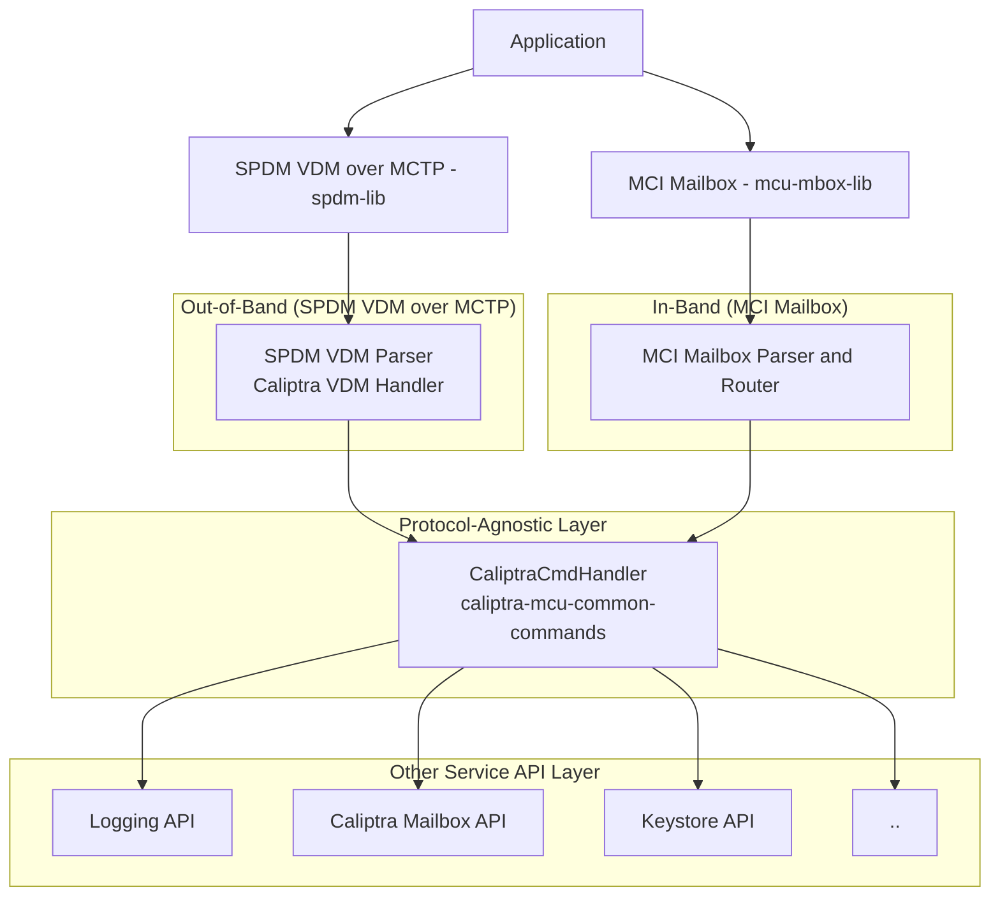

## Unified Handling of External Commands

The Caliptra MCU firmware provides two external command interfaces: [SPDM VDM over MCTP (out-of-band)](caliptra_spdm_vdm_cmds.md) and [MCI Mailbox (in-band)](external_mailbox_cmds.md). Although these interfaces operate over different protocols, they deliver overlapping functionality to external clients.

<span style="font-size: 0.9em;">
<em>Table: Overlapping commands between SPDM VDM (OOB) and MCI Mailbox (IB)</em>
</span>

| **SPDM VDM Command**              | **MCI Mailbox Command**                | **Description**                                         |
|-----------------------------------|----------------------------------------|---------------------------------------------------------|
| Firmware Version                  | MC_FIRMWARE_VERSION                    | Retrieves the version of the firmware.                  |
| Device Capabilities               | MC_DEVICE_CAPABILITIES                 | Retrieves device capabilities.                          |
| Device ID                         | MC_DEVICE_ID                           | Retrieves the device ID.                                |
| Device Information                | MC_DEVICE_INFO                         | Retrieves device information.                           |
| Export CSR                        | MC_EXPORT_IDEV_CSR                     | Exports the IDEVID CSR.                                 |
| Import Certificate                | MC_IMPORT_IDEV_CERT                    | Imports the IDevID certificate.                         |
| Get Log                           | MC_GET_LOG                             | Retrieves the internal log.                             |
| Clear Log                         | MC_CLEAR_LOG                           | Clears the log in the RoT subsystem.                    |
| Request Debug Unlock              | MC_PRODUCTION_DEBUG_UNLOCK_REQ         | Requests debug unlock in a production environment.       |
| Authorize Debug Unlock Token      | MC_PRODUCTION_DEBUG_UNLOCK_TOKEN       | Sends the debug unlock token for authorization.         |
| Export Attested CSR               | MC_EXPORT_ATTESTED_CSR                 | Exports attested CSR for a specified device key.        |

To ensure consistent command behavior and maximize code reuse, we define a protocol-agnostic command handler trait (`CaliptraCmdHandler`) with unified input/output types in the `caliptra-mcu-common-commands` crate. Both protocol frontends parse their respective protocol, then call the same backend handler, ensuring code reuse and consistent behavior.

- **Architecture**

- **Interface** (defined in `caliptra-mcu-common-commands` crate)

```Rust
/// OCP completion codes for Caliptra VDM command responses.
/// See: https://github.com/opencomputeproject/ocp-registry/blob/main/command-registry.md
#[repr(u8)]
pub enum CaliptraCompletionCode {
    Success = 0x00,
    GeneralError = 0x01,
    InvalidParameter = 0x02,
    InvalidLength = 0x03,
    // ... (full set of OCP error codes)
    InvalidState = 0x0F,
}

/// Asynchronous trait for handling commands common to both the out-of-band
/// (SPDM VDM over MCTP) and in-band (MCI Mailbox) paths.
///
/// Each function represents a protocol-agnostic command handler. Implementors
/// provide the specific logic for each command as required by their application.
#[async_trait]
pub trait CaliptraCmdHandler: Send + Sync {
    /// Retrieves the firmware version for the given index.
    async fn get_firmware_version(
        &self,
        index: u32,
        version: &mut FirmwareVersion,
    ) -> Result<(), CaliptraCompletionCode>;

    /// Retrieves the device ID.
    async fn get_device_id(&self, device_id: &mut DeviceId) -> Result<(), CaliptraCompletionCode>;

    /// Retrieves device information for the given index.
    async fn get_device_info(
        &self,
        index: u32,
        info: &mut DeviceInfo,
    ) -> Result<(), CaliptraCompletionCode>;

    /// Retrieves the device capabilities.
    async fn get_device_capabilities(
        &self,
        capabilities: &mut DeviceCapabilities,
    ) -> Result<(), CaliptraCompletionCode>;

    /// Exports an attested CSR for the specified device key.
    ///
    /// Writes the CSR DER data directly into the provided buffer.
    /// Returns the number of bytes written on success.
    async fn export_attested_csr(
        &self,
        device_key_id: u32,
        algorithm: u32,
        nonce: &[u8; 32],
        csr_buf: &mut [u8],
    ) -> Result<usize, CaliptraCompletionCode>;
}
```
