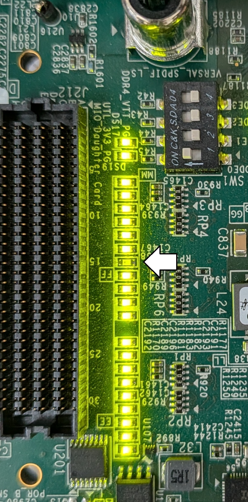

1. Solder a header to pins L05-L02 of J1 of the FMC-XM119-PMOD board packaged with the Versal FPGA.
2. Ensure the jumper for EN1/J3 is bridging the sense pin to GND. This disables the level shifter on the FMC board for PMOD1.
3. Install the FMC card to FMCP1/J51. Labeled (20) in the VCK190 User Guide.
4. Install the I3C driver board on top of the FMC board. The connections are L05-L02 of J1, and 3.3V and GND of PMOD1.
5. Set spare_i3c_control_sts.use_ext_i3c_host

Common issues:
- SCL pad voltage between 0 and 1.5V indicates that the I/O bank is unpowered. The indicated LED below on the side of the board with the power connector will be off.
  - 
  - Connect the System Controller Ethernet port (next to HDMI ports) to the network.
  - Connect to the System Controller serial port (third COM port) and capture IP
  - Navigate to BEAM Tool Web Address printed by System Controller. Port 50002
  - Home->Test The Board->Board Settings->FMC
  - Set VADJ_FMC to 1.5V